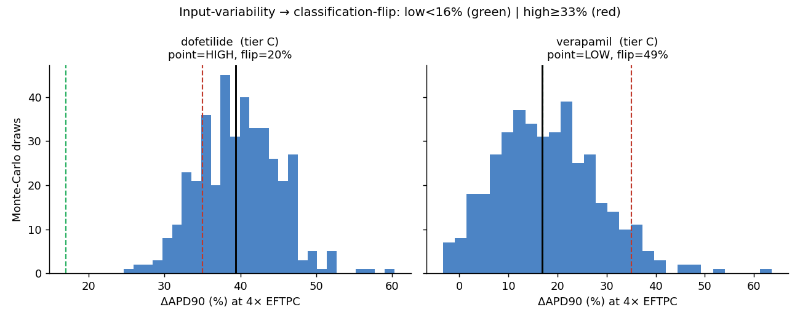
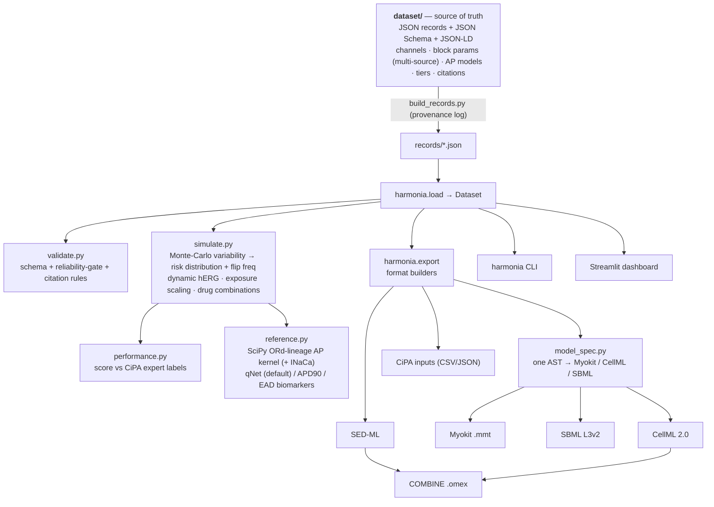
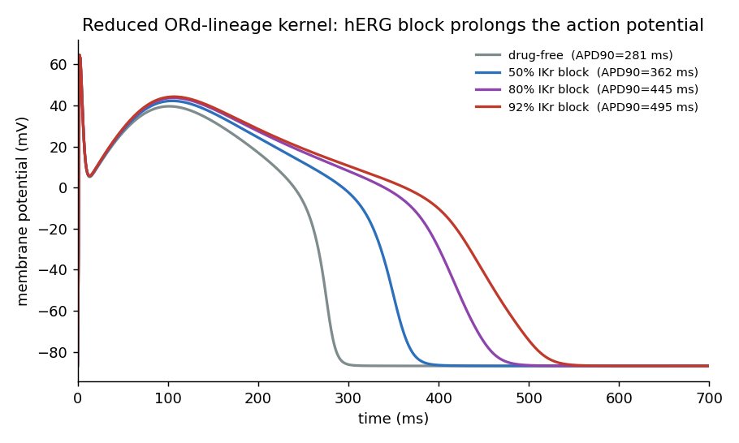
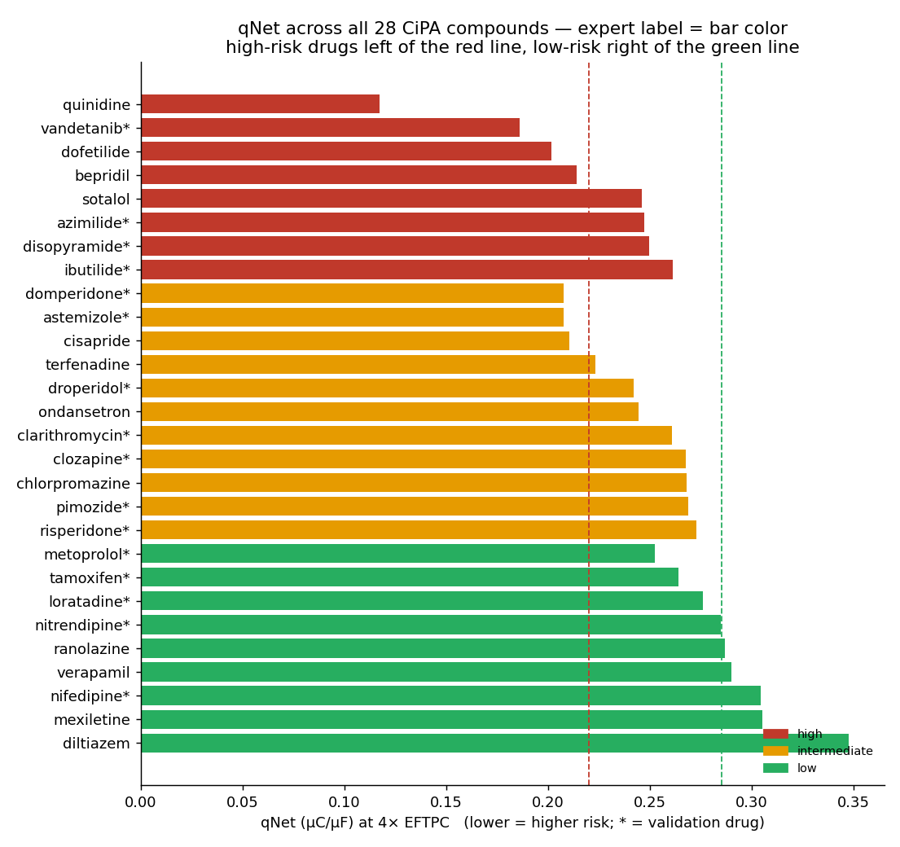
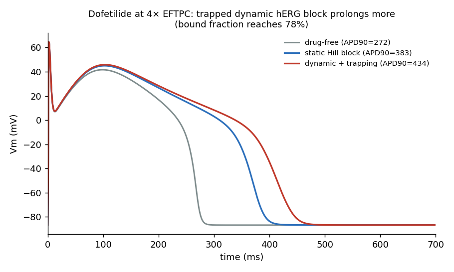
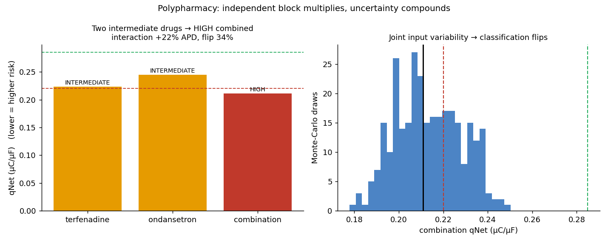

# Harmonia

**A curated, citation-backed, variability-aware dataset of cardiac ion-channel
drug-block parameters and the in-silico ventricular action-potential models that
turn them into a torsade-de-pointes (proarrhythmia) risk *distribution* — not a
verdict.**

[](https://github.com/clay-good/harmonia/actions/workflows/ci.yml)
&nbsp;Code: MIT · Data: CC-BY-4.0 · Python ≥3.9

> Harmonia reports a torsade-risk-metric **distribution** and a
> **classification-flip frequency** that make the dependence of a safety call on
> input-data variability visible by default. **It is NOT a clinical tool and NOT
> a regulatory safety determination.** It never issues a bare "this drug is
> safe/unsafe" verdict. See [Safety & scope](#safety--scope).

Harmonia is the fourth sibling of **Nidus** (gestational physiology), **Hypnos**
(anesthetic PK/PD), and **Onkos** (oncology efficacy) — completing a
physiology → dosing → efficacy → **safety** arc — built on one principle: *a
model is only as trustworthy as its weakest, least-validated input, so make that
a first-class, machine-readable field.* Harmonia's load-bearing idea is the
propagation of **input variability** to the **safety classification**.

---

## The problem, in one figure

Drug-induced QT prolongation and torsade de pointes (TdP) are a leading cause of
late-stage drug attrition. The FDA-initiated [CiPA](https://doi.org/10.1016/j.vascn.2016.06.002)
paradigm assesses risk in silico: measure a drug's block of the major cardiac
currents (an IC50 + Hill per current), feed them into a human ventricular myocyte
model, simulate the action potential, and stratify TdP risk.

**The model machinery is published. The inputs are the problem.** IC50 values for
the *same* drug–channel pair routinely differ several-fold across labs and
platforms, and for a large fraction of published pharmacology the maximum block
observed was below ~60% — which makes the IC50 *unidentifiable*, yet such values
still get used as point estimates. The accuracy of the final risk call depends as
much on input variability and quality as on the model.

Harmonia operationalizes exactly that. Pick a drug; it pulls the *spread* of
published IC50s per channel, propagates that spread through the chosen AP model
by Monte-Carlo, and shows how often the high/intermediate/low classification
**flips** depending on which sources you believe:



A near-pure hERG blocker like **dofetilide** lands tightly in HIGH (2% flip under
qNet). A balanced multichannel blocker like **verapamil** straddles the
low/intermediate boundary — its classification flips on **~36%** of draws. The
same drug, different believed sources, different safety call. That is the finding
the uncertainty-quantification literature
([Chang et al. 2017](https://doi.org/10.3389/fphys.2017.00917)) demonstrated and
that no dataset operationalized — until this one. (The metric is **qNet**, the
CiPA net-charge biomarker; lower qNet means higher risk.)

---

## Quickstart

```bash
git clone https://github.com/clay-good/harmonia
cd harmonia
pip install -e ".[dev]"      # numpy, scipy, jsonschema

harmonia validate            # JSON-Schema- + semantically validate the dataset
harmonia info                # counts by subsystem / tier / review status
harmonia simulate dofetilide --mc 200          # qNet metric (default); --metric apd90 to switch
harmonia flip verapamil      # classification stability across AP-model variants
harmonia combo terfenadine ondansetron         # drug-combination (polypharmacy) assessment
harmonia performance         # score qNet vs CiPA expert labels (train/val/all); --metric apd90
harmonia export --all --output exports/
```

```python
import harmonia
ds = harmonia.load()

b = ds["channel_block.dofetilide.ikr"]
b.tier                                       # "A"
b.assay_context.max_block_observed_percent   # 95  (>60 => identifiable)
b.variability.fold_range                     # 1.65  -> inter-source spread is first-class
b.source_values                              # the individual lab measurements

# Simulate an action potential + risk-metric DISTRIBUTION (never a bare verdict)
res = harmonia.assess(ds, "dofetilide", ap_model="cipaordv1.0", n_mc=200)  # metric="qnet" (default)
res.qnet_distribution                         # distribution, not a point value
res.classification_flip_frequency             # how often the class flips
res.tier, res.warnings, res.excluded_channels # propagated tier + unidentifiable-channel flags
harmonia.assess(ds, "dofetilide", metric="apd90")   # the classic QT/APD surrogate instead

# Headline comparison across AP-model variants
cmp = harmonia.flip_view(ds, "verapamil", ap_models=["ord", "cipaordv1.0", "tor_ord"])
cmp.flip_by_model                             # {'ord': 'low', 'cipaordv1.0': 'intermediate', ...}
cmp.stable_across_models                      # False

# Dynamic (CiPA-style) hERG binding with trapping, where kinetics are recorded
res = harmonia.assess(ds, "dofetilide", herg_dynamic=True)   # trapped blocker -> extra prolongation

# Exposure layer: drive block from a TOTAL plasma concentration via protein binding
res = harmonia.assess(ds, "verapamil", exposure_nM=3200, exposure_kind="total")  # free = fu * total
harmonia.free_from_total(3200, 0.10)          # 320.0 nM free

# Drug combination (polypharmacy): joint variability, the interaction, the flip
combo = harmonia.assess_combination(ds, ["terfenadine", "ondansetron"], n_mc=200)
combo.classification                          # "high"  (two intermediates -> high together)
combo.interaction_dapd90_pct                  # extra prolongation beyond the worst single agent
combo.classification_flip_frequency           # joint-uncertainty flip frequency
```

---

## What's in the box (Phases A + B + C-start + D)

| Layer | Status |
| --- | --- |
| **Dataset** — 68 channel-block records across the **28 CiPA compounds** (12 training + 16 validation), 28 drug-reference records (expert risk label + free Cmax + protein binding), 3 AP-model records, 10 Crossref-checked citations | ✅ |
| **Variability is first-class** — multi-source IC50s with computed fold-range / IQR; the reliability gate (max block < 60% ⇒ Tier D, unidentifiable) machine-enforced | ✅ |
| **Reference kernel** — a SciPy reduced O'Hara-Rudy-lineage ventricular AP (7 currents + Na-Ca exchanger) with Hill block per current; APD90 / qNet / triangulation / EAD biomarkers | ✅ |
| **Discriminating qNet** (Phase C) — adding a shape-dependent Na-Ca exchanger (excluded from the qNet sum) makes qNet sensitive; **qNet is now the default metric** (10/12 training, zero two-category errors over all 28 compounds); APD90 selectable | ✅ |
| **Dynamic hERG binding** (Phase B) — Langmuir kon/koff with **trapping**; reduces to the static Hill block at steady state, captures use-dependent block (`assess(..., herg_dynamic=True)`) | ✅ |
| **Exposure layer** (Phase D) — free ↔ total plasma conversion via protein binding (`fraction_unbound`); assess from a free or total concentration (composable with a Hypnos PK trajectory) | ✅ |
| **Drug combinations** (Phase D) — `assess_combination` propagates *joint* IC50 variability; independent block multiplies per channel; reports the interaction and how often the combined class flips | ✅ |
| **Risk distribution + flip frequency** — Monte-Carlo over source variability; classification-flip frequency; worst-tier propagation | ✅ |
| **Recorded classification performance** (Phase B) — `harmonia performance` scores either metric vs CiPA expert labels on training / validation / all, with the full confusion matrix | ✅ |
| **Exports** — CellML 2.0, Myokit `.mmt`, SBML L3v2, SED-ML, CiPA inputs (CSV/JSON), CSV, BibTeX, COMBINE `.omex` — all carrying `clinicalUse = PROHIBITED`, tier, and DOI RDF | ✅ |
| **CLI · Streamlit dashboard · CI** | ✅ |
| Full CiPA Markov hERG + published optimized kinetics, ToR-ORd reformulation, broader multi-source aggregation, populations | Phase C/E–F (roadmap below) |

---

## Architecture

The **dataset is the single source of truth**; everything else is a
deterministic projection.



Every model export is generated from **one** renderer-agnostic
[`model_spec`](python/harmonia/export/model_spec.py) (a tiny expression AST), so
the Myokit, CellML, and SBML artifacts cannot drift from each other or from the
[`reference`](python/harmonia/export/reference.py) kernel — the numeric oracle.

---

## The record — the unit of curation

```jsonc
{
  "id": "channel_block.dofetilide.ikr",
  "kind": "channel_block",
  "drug": { "name": "dofetilide", "unii": "R4Z9X1N42Q" },
  "channel": "IKr",
  "parameters": [ { "symbol": "IC50",
      "value": { "central": 5.06, "low": 4.0, "high": 6.6, "units": "nM" } } ],
  "assay_context": { "max_block_observed_percent": 95 },   // <60 => unidentifiable => Tier D
  "source_values": [                                       // the variability, made first-class
    { "ic50_nm": 4.9, "platform": "manual",    "citation": "crumb-2016" },
    { "ic50_nm": 6.6, "platform": "automated", "citation": "kramer-2013" },
    { "ic50_nm": 4.0, "platform": "manual",    "citation": "li-2017" } ],
  "variability": { "fold_range": 1.65, "n_sources": 3, "iqr_nm": [4.45, 5.75] },
  "tier": "A",
  "extraction": { "review_status": "unverified" }          // honest by default — see below
}
```

The two load-bearing fields:

- **`source_values` + `variability`** — *multiple* labs'/assays' measurements of
  the same IC50, with the inter-source spread computed and stored. Input
  variability is not hidden behind a single number.
- **`assay_context.max_block_observed_percent`** — below ~60% block the IC50 is
  unidentifiable and any point estimate is fiction. This is what lets a Tier-D
  "we don't actually know this IC50" be stated honestly. (`ranolazine.ical`,
  max block 35%, is the worked example: it is excluded from simulation and caps
  any assessment that touches it at Tier D.)

---

## Confidence tiers & propagation

| Tier | Channel block | AP model |
| --- | --- | --- |
| **A** | Multiple labs agree (low fold-range), block ≳60% so IC50 identifiable | Validated on CiPA validation set |
| **B** | One good measurement with adequate block; a single well-curated source | Published, internally validated |
| **C** | Single measurement; low/borderline block; unresolved manual-vs-automated discrepancy | Reduced / reference kernel |
| **D** | **Max block < ~60%** (IC50 unidentifiable), population extrapolation, or hypothesis-tier — **not predictive** | — |

**Two hard, machine-checked rules** (`harmonia validate` enforces both):

1. **The reliability gate** — `max_block < 60%` ⟺ Tier D ⟺ a `known_failure_mode`
   is present. No point IC50 is recorded as if reliable.
2. **Worst-input-wins** — a composed assessment inherits the *worst* tier among
   its channel-block records + AP model. One unidentifiable IC50 caps the whole
   assessment at D — *and* the input variability is propagated by Monte-Carlo,
   producing a distribution of outcomes and a flip frequency, never a bare class.

> **`verified` vs the tier.** The *tier* is data quality (do labs agree? is the
> IC50 identifiable?). `review_status` is whether a human opened the source PDF.
> They are orthogonal. Every v0.1 record ships **`unverified`** — the values are
> literature-derived but no PDF has been confirmed inside Harmonia. *LLMs assist
> extraction but never promote to verified.* `harmonia info` reports the verified
> count honestly (currently 0/99). Promoting records by reading the source is the
> single highest-leverage contribution — see [CONTRIBUTING](CONTRIBUTING.md).

---

## The reference kernel — what it is, and what it is honestly not

The bundled kernel is a **reduced** O'Hara-Rudy-lineage human ventricular AP:
seven named currents (INa, INaL, Ito, ICaL, IKr, IKs, IK1) plus a phenomenological
Na-Ca exchanger (INaCa), with Hodgkin-Huxley gating, an algebraic inward
rectifier, and fixed ionic concentrations, paced at 0.5 Hz. It is structurally
faithful, numerically stable (steady state in ~3 beats), and reproduces the
qualitative pharmacology CiPA rests on:



It is **not** bit-exact to the published ORd CellML, so AP-model records ship at
**Tier C**. Two design facts are worth stating plainly:

- **qNet is the default metric, and it works (Phase C).** CiPA replaced APD with
  *qNet* — the integral of the six currents INaL + ICaL + IKr + IKs + IK1 + Ito
  over the beat (lower qNet = higher risk). In a pump-free kernel that sum is
  charge-conserved and so insensitive to block. Adding the **Na-Ca exchanger and
  excluding it from the qNet sum** breaks that conservation and makes qNet
  genuinely discriminate. ΔAPD90% remains selectable (`metric="apd90"`).
- **The classifier is a methodology demonstrator, not a qualified classifier.**
  Calibrated on the 12 CiPA training drugs under the default model (qNet
  thresholds: high < 0.220, low > 0.285), the reduced kernel recovers **10/12**
  training labels — and across the full 28-compound set it makes **zero
  two-category errors** (it never calls a high-risk drug low, or vice versa):



High-risk drugs (red) sit left of the red line, low-risk (green) right of the
green line; the asterisked drugs are the 16-compound validation set. The kernel
also captures the *protective* multichannel mechanism: **diltiazem and verapamil's
ICaL block** raises their qNet (lowers risk), via an L-type window current.

### Recorded classification performance (Phase B/C)

`harmonia performance` scores either metric against the CiPA expert labels and
prints the full confusion matrix. Honest numbers under the default qNet metric:

| Set | Exact accuracy | Within-one-category |
| --- | --- | --- |
| Training (12) | 10/12 (83%) | 12/12 (100%) |
| Validation (16) | 7/16 (44%) | 16/16 (100%) |
| All 28 | 17/28 (61%) | 28/28 (100%) |

qNet beats the APD90 surrogate (8/12 training, ~82% within-one) on both counts.
The validation set is honestly harder on exact 3-way accuracy: many validation
drugs have very low free Cmax, so block at 4× EFTPC is sub-IC50 and *both* metrics
underread them. But qNet never makes a catastrophic (two-category) error on any of
the 28 compounds — the property that matters most for a safety screen. The durable
contribution remains the **flip-frequency-under-variability machinery**, correct
regardless of absolute accuracy.

### Dynamic hERG binding (Phase B)

hERG records can carry **dynamic binding kinetics** (`kon`, `koff`, `trapping`).
With `assess(..., herg_dynamic=True)` the kernel integrates a Langmuir binding ODE
instead of applying a static Hill factor. It reduces to the static block at steady
state (verified in tests) but captures **use-dependent trapping**: dofetilide, the
prototypical trapped blocker, accumulates more block over successive beats and
prolongs the AP further than the static estimate.



### Exposure layer & drug combinations (Phase D)

Block is driven by the **free** (unbound) drug concentration, but clinical PK
usually reports the **total** plasma Cmax; the two differ by the fraction unbound
(`fu`), often by one to two orders of magnitude. Drug-reference records carry
`protein_binding.fraction_unbound`, and `assess(..., exposure_kind="total")`
converts a total concentration to free (`free = fu × total`) before scaling block
— so a total-concentration PK trajectory, including a Hypnos output, can drive a
Harmonia assessment.

`assess_combination` extends the thesis to **polypharmacy**. Block from
independent agents multiplies per channel (the fraction of a current remaining is
the product of each drug's remaining fraction), and the IC50 variability of
*every* drug is propagated jointly by Monte-Carlo. The result: two drugs that are
each "intermediate" alone can combine into a **high** classification, and the
combined call carries its own flip frequency.



`terfenadine + ondansetron` at therapeutic exposures cross into HIGH (qNet 0.21),
with ~+22% extra APD prolongation beyond the worst single agent and a ~34%
classification-flip frequency under joint input variability. The combined safety
call is only as trustworthy as its least-identifiable input — the single-drug
principle, extended to the combination.

Figures regenerate from the dataset with `python docs/make_figures.py`.

---

## Export formats

| Format | Role | File |
| --- | --- | --- |
| **CellML 2.0** | Native language of cardiac EP / the Physiome repo; shared with Nidus | [`exports/cellml/`](exports/cellml) |
| **Myokit `.mmt`** | The most directly *runnable* artifact (model + pacing protocol) | [`exports/myokit/`](exports/myokit) |
| **SBML L3v2** | ODE system → COPASI / Tellurium / BioModels | [`exports/sbml/`](exports/sbml) |
| **CiPA inputs** | The IC50/Hill table the CiPA in-silico tool ingests (+ variability/tier columns) | [`exports/tables/cipa_inputs.csv`](exports/tables/cipa_inputs.csv) |
| **SED-ML** | Reproducible pacing/simulation protocol, paired with CellML | [`exports/sedml/`](exports/sedml) |
| **COMBINE `.omex`** | Bundles CellML + SBML + SED-ML + provenance | [`exports/omex/`](exports/omex) |
| **CSV / BibTeX** | Flat parameter + citation export | [`exports/tables/`](exports/tables) |

Every exported model carries a universal, machine-readable
`harmonia:clinicalUse = "PROHIBITED — research / safety-methodology / education
only; not a regulatory determination"` annotation, plus the propagated tier and
`bqbiol:isDescribedBy` DOI links as MIRIAM-style RDF. **Exports are generated,
never hand-edited** (CI regenerates and round-trip-validates on every push). The
CiPA-input export has a true numeric round trip (parse back ⇒ dataset values);
the kernel constants are verified to survive the CellML/SBML/Myokit text.

---

## Design decisions

| Decision | Rationale |
| --- | --- |
| **Pure-Python reference kernel (SciPy); Myokit/OpenCOR optional** | Validation must not depend on a heavy engine at load time; exports are artifacts. |
| **Dataset is the centerpiece; everything else is a projection** | The durable contribution is the curated, multi-source, tier-annotated block parameters. |
| **`source_values` + `assay_context` first-class; variability propagated** | Input variability — not the model — is the dominant uncertainty; making it machine-enforced is the load-bearing idea. |
| **Output is a risk *distribution* + flip frequency, never a bare class** | A single high/intermediate/low label hides exactly the uncertainty that matters. |
| **Worst input wins; unidentifiable IC50 caps at D** | A safety call is only as trustworthy as its least-identifiable channel. |
| **One AST → all model exports** | Myokit/CellML/SBML provably cannot drift from each other or the kernel. |
| **qNet default (via a shape-dependent INaCa), APD90 selectable; kernel honestly Tier C** | qNet is the CiPA-canonical metric and now discriminates; the reduced kernel is not the qualified ORd, so it stays Tier C and over-claims nothing. |
| **Methodology only; never a regulatory or clinical determination** | The line is making (or appearing to make) a safety verdict. |

---

## Repository layout

```
harmonia/
├── spec.md                      # the design spec (v0.1)
├── dataset/                     # SOURCE OF TRUTH
│   ├── schema/                  # JSON Schema + JSON-LD context
│   ├── records/                 # one JSON per channel-block / AP-model / drug-reference record
│   ├── citations/               # Crossref/PubMed-checked citation records
│   └── tools/build_records.py   # provenance log: the curated table → records (CI checks reproducibility)
├── python/harmonia/
│   ├── load.py · validate.py · filter.py · records.py
│   ├── simulate.py              # Monte-Carlo variability → risk distribution + flip view; dynamic hERG; combinations
│   ├── exposure.py              # free ↔ total plasma concentration (protein binding)
│   ├── performance.py           # score the kernel vs CiPA expert labels (confusion matrix)
│   ├── cli.py
│   └── export/
│       ├── reference.py         # SciPy ORd-lineage AP kernel + risk metrics (the oracle)
│       ├── model_spec.py        # one expression AST → Myokit / CellML / SBML
│       ├── cellml.py · myokit.py · sbml.py · sedml.py · cipa_inputs.py
│       ├── csv_bibtex.py · annotate.py · combine.py · registry.py
├── dashboard/app.py             # Streamlit: browse + risk-uncertainty (flip) view
├── tests/                       # 68 tests: dataset, kernel, qNet, simulate, dynamic binding, exposure, combinations, performance, exports, CLI
├── docs/                        # essay, figures, make_figures.py
└── exports/                     # sample generated artifacts (regenerated in CI)
```

---

## Safety & scope

**Non-negotiable (spec.md §10).** Harmonia is **NOT** a clinical tool, **NOT** a
regulatory safety determination, and **NOT** a verdict that a drug is safe or
unsafe. It is research, method development, education, and *support for* — never
replacement of — the CiPA paradigm.

- No bare safety classification as an authoritative output. Harmonia reports a
  risk-metric **distribution** with its full input uncertainty and a
  classification-flip frequency.
- Unidentifiable inputs are **stated, not imputed** (max block < 60% ⇒ Tier D).
- Every export carries `clinicalUse = PROHIBITED`.
- The `populations` subsystem (Phase E) ships hypothesis-tier, non-predictive.

The tell that the project has crossed its line: any feature that emits a single,
authoritative "this drug is safe/unsafe" verdict without its uncertainty. That
feature does not get built.

---

## Roadmap

| Phase | Content | Status |
| --- | --- | --- |
| **A — CiPA spine** | Channel block + ORd kernel + risk metric for the 12 training drugs, end to end, with exports, validation, and the flip view | ✅ |
| **B — Dynamic hERG + validation** | Dynamic (Langmuir + trapping) hERG binding; the 16 validation drugs (28 CiPA compounds total); recorded classification performance | ✅ |
| **C — Variability layer** | **Discriminating qNet via a shape-dependent Na-Ca exchanger ✅.** Remaining: full CiPA Markov hERG + published optimized kinetics; broader multi-source aggregation; ToR-ORd reformulation | ◧ |
| **D — Exposure layer** | Free ↔ total plasma conc + protein binding (composable with Hypnos); drug-combination assessment | ✅ **this release** |
| **E — Populations** | Population-of-models / disease backgrounds, shipped non-predictive | ◻ |
| **F — Hardening** | CellML unit conformance + OpenCOR cross-check; Zenodo DOI; perf | ◻ |

---

## Licensing & citation

- **Code:** MIT ([LICENSE](LICENSE)). **Dataset:** CC-BY-4.0 ([LICENSE-DATASET](LICENSE-DATASET)).
- When you use a record, cite **Harmonia** *and* the primary source(s) named in
  that record (`record.primary_citation.doi`). Machine-readable metadata in
  [CITATION.cff](CITATION.cff).

Harmonia shares **CellML** with Nidus (the Physiome lineage) and **composes with
Hypnos**: a drug's free-plasma-concentration trajectory (Hypnos PK) can scale
Harmonia's channel block, giving an open, tier-annotated PK → proarrhythmia
chain — the dosing and safety ends of the same molecule, in one toolchain.
