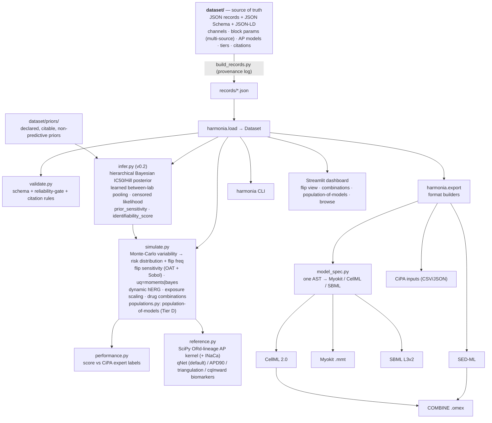
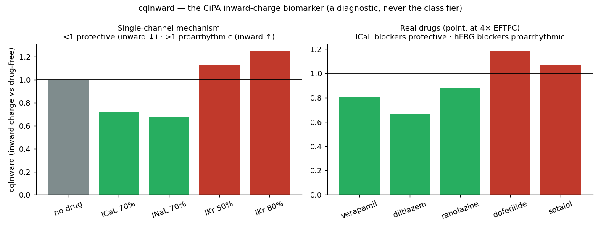
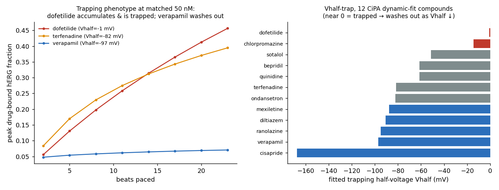
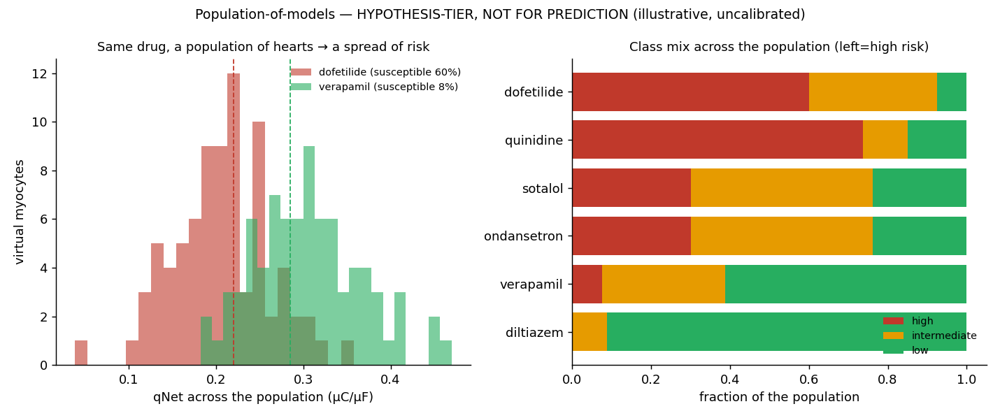
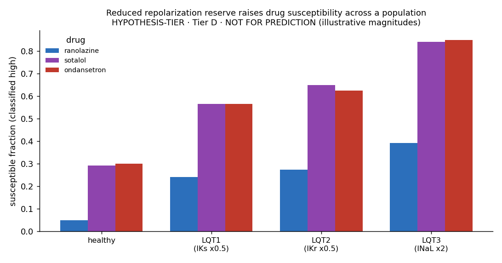
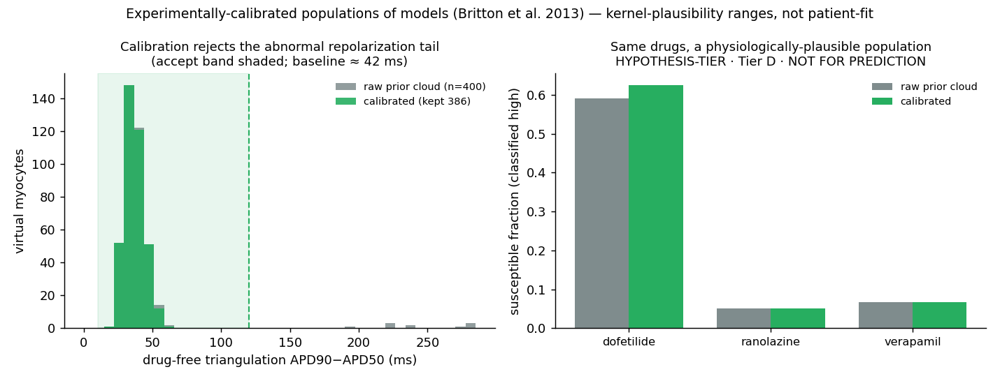
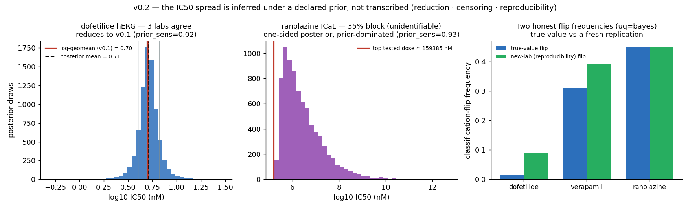

# Harmonia

**A curated, citation-backed, variability-aware dataset of cardiac ion-channel
drug-block parameters and the in-silico ventricular action-potential models that
turn them into a torsade-de-pointes (proarrhythmia) risk *distribution* — not a
verdict.**

[](https://github.com/clay-good/harmonia/actions/workflows/ci.yml)
&nbsp;Code: MIT · Data: CC-BY-4.0 · Python ≥3.9

> Harmonia reports a torsade-risk-metric **distribution** and a
> **classification-flip frequency** that make the dependence of a safety call on
> input-data variability visible by default. **It is NOT a clinical tool and NOT
> a regulatory safety determination.** It never issues a bare "this drug is
> safe/unsafe" verdict. See [Safety & scope](#safety--scope).

Harmonia is the fourth sibling of **Nidus** (gestational physiology), **Hypnos**
(anesthetic PK/PD), and **Onkos** (oncology efficacy) — completing a
physiology → dosing → efficacy → **safety** arc — built on one principle: *a
model is only as trustworthy as its weakest, least-validated input, so make that
a first-class, machine-readable field.* Harmonia's load-bearing idea is the
propagation of **input variability** to the **safety classification**.

---

## The problem, in one figure

Drug-induced QT prolongation and torsade de pointes (TdP) are a leading cause of
late-stage drug attrition. The FDA-initiated [CiPA](https://doi.org/10.1016/j.vascn.2016.06.002)
paradigm assesses risk in silico: measure a drug's block of the major cardiac
currents (an IC50 + Hill per current), feed them into a human ventricular myocyte
model, simulate the action potential, and stratify TdP risk.

**The model machinery is published. The inputs are the problem.** IC50 values for
the *same* drug–channel pair routinely differ several-fold across labs and
platforms, and for a large fraction of published pharmacology the maximum block
observed was below ~60% — which makes the IC50 *unidentifiable*, yet such values
still get used as point estimates. The accuracy of the final risk call depends as
much on input variability and quality as on the model.

Harmonia operationalizes exactly that. Pick a drug; it pulls the *spread* of
published IC50s per channel, propagates that spread through the chosen AP model
by Monte-Carlo, and shows how often the high/intermediate/low classification
**flips** depending on which sources you believe:


A near-pure hERG blocker like **dofetilide** lands tightly in HIGH (2% flip under
qNet). A balanced multichannel blocker like **verapamil** straddles the
low/intermediate boundary — its classification flips on **~36%** of draws (Wilson
95% CI 30–43% at 200 Monte-Carlo draws; the flip frequency is itself an estimate,
and **v0.7** reports its sampling interval, §[flip-frequency CI](#the-flip-frequency-is-itself-an-estimate-v07)).
The same drug, different believed sources, different safety call. That is the
finding the uncertainty-quantification literature
([Chang et al. 2017](https://doi.org/10.3389/fphys.2017.00917)) demonstrated and
that no dataset operationalized — until this one. (The metric is **qNet**, the
CiPA net-charge biomarker; lower qNet means higher risk.)

---

## Quickstart

```bash
git clone https://github.com/clay-good/harmonia
cd harmonia
pip install -e ".[dev]"      # runtime (numpy, scipy, jsonschema) + test/lint tooling

harmonia validate            # JSON-Schema- + semantically validate the dataset
harmonia info                # counts by subsystem / tier / review status
harmonia simulate dofetilide --mc 200          # qNet metric (default); --metric apd90 to switch
harmonia simulate dofetilide --uq bayes        # v0.2 hierarchical-Bayesian uncertainty propagation
harmonia infer verapamil     # v0.2 per-channel IC50/Hill posteriors + sampler diagnostics
harmonia priors              # the prior registry (declared, citable, non-predictive)
harmonia flip verapamil      # classification stability across AP-model variants
harmonia sensitivity verapamil                 # which channel's IC50 spread drives the flip
harmonia sensitivity verapamil --sobol         # variance-based indices WITH interactions (v0.2)
harmonia combo droperidol ondansetron          # drug-combination (polypharmacy) assessment
harmonia population sotalol  # population-of-models spread (HYPOTHESIS-TIER, not for prediction)
harmonia performance         # score qNet vs CiPA expert labels (train/val/all); --metric apd90
harmonia crosscheck          # v0.8 diff transcribed IC50/Hill vs the published CiPA reference
harmonia export --all --output exports/
```

```python
import harmonia
ds = harmonia.load()

b = ds["channel_block.dofetilide.ikr"]
b.tier                                       # "A"
b.assay_context.max_block_observed_percent   # 95  (>60 => identifiable)
b.variability.fold_range                     # 1.65  -> inter-source spread is first-class
b.source_values                              # the individual lab measurements

# Simulate an action potential + risk-metric DISTRIBUTION (never a bare verdict)
res = harmonia.assess(ds, "dofetilide", ap_model="cipaordv1.0", n_mc=200)  # metric="qnet" (default)
res.qnet_distribution                         # distribution, not a point value
res.classification_flip_frequency             # how often the class flips
res.tier, res.warnings, res.excluded_channels # propagated tier + unidentifiable-channel flags
harmonia.assess(ds, "dofetilide", metric="apd90")   # the classic QT/APD surrogate instead

# Headline comparison across AP-model variants
cmp = harmonia.flip_view(ds, "verapamil", ap_models=["ord", "cipaordv1.0", "tor_ord"])
cmp.flip_by_model                             # {'ord': 'low', 'cipaordv1.0': 'intermediate', ...}
cmp.stable_across_models                      # False

# Which input drives the flip? — per-channel uncertainty attribution
sens = harmonia.flip_sensitivity(ds, "verapamil")
sens.dominant_channel                         # 'ICaL' — the IC50 to pin down first
sens.channels[0].solo_flip_frequency          # flip freq when ONLY ICaL's IC50 varies

# v0.2 — Bayesian dose-response UQ: infer the IC50/Hill posterior, don't transcribe it
res = harmonia.assess(ds, "dofetilide", uq="bayes")   # posterior-predictive propagation
res.classification_flip_frequency             # samples the TRUE-value posterior
res.reproducibility_flip_frequency            # samples the NEW-LAB predictive (a fresh replication)
res.censored_channels, res.prior_dominated_channels   # one-sided / prior-shaped flags
post = harmonia.posterior(ds, "dofetilide", "IKr")    # the inferred object, not a point
post.mean_log10, post.sd_log10, post.identifiability_score, post.prior_sensitivity
sob = harmonia.flip_sensitivity(ds, "verapamil", method="sobol")   # interaction-aware
sob.channels[0].total_effect, sob.channels[0].interaction_load     # S_Ti and S_Ti - S_i

# Dynamic (CiPA-style) hERG binding with trapping, where kinetics are recorded
res = harmonia.assess(ds, "dofetilide", herg_dynamic=True)   # trapped blocker -> extra prolongation

# Exposure layer: drive block from a TOTAL plasma concentration via protein binding
res = harmonia.assess(ds, "verapamil", exposure_nM=3200, exposure_kind="total")  # free = fu * total
harmonia.free_from_total(3200, 0.10)          # 320.0 nM free

# Drug combination (polypharmacy): joint variability, the interaction, the flip
combo = harmonia.assess_combination(ds, ["droperidol", "ondansetron"], n_mc=200)
combo.classification                          # "high"  (two intermediates -> high together)
combo.interaction_dapd90_pct                  # extra prolongation beyond the worst single agent
combo.classification_flip_frequency           # joint-uncertainty flip frequency

# Population-of-models (HYPOTHESIS-TIER, Tier D, not for prediction)
pop = harmonia.assess_population(ds, "sotalol", n_models=100)
pop.susceptible_fraction                      # fraction of the population classified "high"
pop.tier                                      # "D"  (always; non-predictive)
```

---

## What's in the box (Phases A + B + C + D + E + F-start)

| Layer | Status |
| --- | --- |
| **Dataset** — 68 channel-block records across the **28 CiPA compounds** (12 training + 16 validation), 28 drug-reference records (expert risk label + free Cmax + protein binding), 3 AP-model records, 5 population specs (1 variability + 3 LQTS disease backgrounds + 1 experimentally-calibrated), 16 Crossref-checked citations | ✅ |
| **Variability is first-class** — multi-source IC50s with computed fold-range / IQR; the reliability gate (max block < 60% ⇒ Tier D, unidentifiable) machine-enforced | ✅ |
| **Bayesian dose-response UQ** (Phase C, **v0.2**) — the IC50/Hill spread is *inferred* under a declared prior, not transcribed: hierarchical posterior with dataset-learned between-lab pooling, propagated Hill uncertainty, a one-sided **censored** posterior for sub-60%-block channels, a **raw dose-response regime** (fit from concentration-block points), a prior registry with per-channel `prior_sensitivity`, variance-based (Sobol) sensitivity, and a calibrated inference (simulation-based calibration + posterior coverage). Opt-in via `uq="bayes"`; `uq="moments"` (default) reproduces every v0.1 number | ✅ |
| **Reference kernel** — a SciPy reduced O'Hara-Rudy-lineage ventricular AP (7 currents + Na-Ca exchanger) with Hill block per current; APD90 / qNet / triangulation / **cqInward** / EAD biomarkers | ✅ |
| **Discriminating qNet** (Phase C) — adding a shape-dependent Na-Ca exchanger (excluded from the qNet sum) makes qNet sensitive; **qNet is now the default metric** (9/12 training, zero two-category errors over all 28 compounds); APD90 selectable | ✅ |
| **Dynamic hERG binding** (Phase B) — Langmuir kon/koff with **trapping**; reduces to the static Hill block at steady state, captures use-dependent block (`assess(..., herg_dynamic=True)`) | ✅ |
| **CiPA dynamic-hERG kinetics** (**v0.6**) — the real published Li-2017 IKr-Markov binding parameters (`Kmax`/`Ku`/`halfmax`/`n`/`Vhalf`) for the **12 CiPA dynamic-fit compounds**, sourced from the FDA/CiPA repository as a citation-backed `cipa_binding` field; a faithful binding model reproducing the **trapping phenotype** (`assess(..., herg_dynamic="cipa")`). Data authoritative (not human-`verified`; the IC50 ships `pending_human_review`); model an opt-in Tier-C reduction that touches no default number | ✅ |
| **Exposure layer** (Phase D) — free ↔ total plasma conversion via protein binding (`fraction_unbound`); assess from a free or total concentration (composable with a Hypnos PK trajectory) | ✅ |
| **Drug combinations** (Phase D) — `assess_combination` propagates *joint* IC50 variability; independent block multiplies per channel; reports the interaction and how often the combined class flips | ✅ |
| **Population-of-models** (Phase E) — `assess_population` samples a population of virtual myocytes (per-conductance variability) to spread a drug's risk across individuals. **Hypothesis-tier, Tier D, NOT FOR PREDICTION** | ✅ |
| **Disease / genetic backgrounds** (**v0.3**) — the three congenital long-QT channelopathies (LQT1 IKs↓, LQT2 IKr↓, LQT3 INaL↑) as population records: a per-current *mean* conductance shift recenters the variability cloud on a reduced-repolarization-reserve background, so a drug's risk distribution can be re-evaluated against a susceptible subpopulation. **Hypothesis-tier, Tier D, NOT FOR PREDICTION** | ✅ |
| **Experimentally-calibrated populations** (**v0.5**) — the Britton-2013 calibration-by-rejection: a virtual myocyte enters the population only if its *drug-free* AP biomarkers (APD90, rest/peak potential, triangulation) are physiologically plausible, removing the abnormal-repolarization tail of the raw prior. Acceptance ranges are kernel-plausibility bounds (not patient-fit), so it stays **Tier D, NOT FOR PREDICTION** | ✅ |
| **Risk distribution + flip frequency** — Monte-Carlo over source variability; classification-flip frequency; worst-tier propagation | ✅ |
| **Flip-frequency confidence interval** (**v0.7**) — the headline flip frequency is a Monte-Carlo binomial proportion, so it now carries a **Wilson 95% CI** (`flip_ci`) derived from `n_mc`; same for the combination flip, the all-vary flip sensitivity, the new-lab reproducibility flip, and the population susceptible fraction. The project's own "never a number without its uncertainty" rule, applied to its own headline number. Purely additive — no previously-reported value moves | ✅ |
| **Flip sensitivity** — `flip_sensitivity` attributes the flip to each channel's IC50 spread (solo / frozen effects), surfacing the dominant uncertain input to pin down first | ✅ |
| **Recorded classification performance** (Phase B) — `harmonia performance` scores either metric vs CiPA expert labels on training / validation / all, with the full confusion matrix | ✅ |
| **Machine cross-check** (**v0.8**) — `harmonia.cross_check` diffs every channel-block record's transcribed IC50/Hill against an *independent* published copy of the CiPA table (Li 2017, via the FDA/CiPA file) and assigns `machine_cross_checked` — a provenance signal between `unverified` and `verified` that is **deliberately not** `verified` (no human read the PDF). Caught two real unit-scale transcription errors on first run | ✅ |
| **`pending_human_review` + sourced data** (**v0.8.2–0.8.3**) — a third `review_status` between `unverified` and `verified`: a value machine-corroborated against an *independent* published source (provenance in `extraction.corroboration`), awaiting a human's PDF confirmation. Filled by sourcing the validation drugs' hERG (**Ridder 2020**, re-verified vs the published table), ICaL (**Li 2019**), and every drug's free EFTPC + CiPA risk category (**FDA/CiPA** simulation inputs, cross-checked vs Llopis-Lorente 2022). **83/104 records** now sourced-and-corroborated; `verified` stays 0/104 (§9). Surfaced a 200× ibutilide-EFTPC discrepancy, left flagged | ✅ |
| **Exports** — CellML 2.0, Myokit `.mmt`, SBML L3v2, SED-ML, CiPA inputs (CSV/JSON), CSV, BibTeX, COMBINE `.omex` — all carrying `clinicalUse = PROHIBITED`, tier, and DOI RDF | ✅ |
| **CLI · Streamlit dashboard · CI** | ✅ |
| **Release hardening** (Phase F) — declaration-level CellML unit-conformance check, three executable `nbmake` notebooks, `.zenodo.json`, `CHANGELOG.md`, machine cross-check vs the published CiPA reference (v0.8) | ✅ |
| Full CiPA Markov hERG + published optimized kinetics, ToR-ORd reformulation, broader multi-source aggregation, full dimensional/OpenCOR cross-check | Phase C/F (roadmap below) |

---

## Architecture

The **dataset is the single source of truth**; everything else is a
deterministic projection.



Every model export is generated from **one** renderer-agnostic
[`model_spec`](python/harmonia/export/model_spec.py) (a tiny expression AST), so
the Myokit, CellML, and SBML artifacts cannot drift from each other or from the
[`reference`](python/harmonia/export/reference.py) kernel — the numeric oracle.
"Cannot drift" is *enforced*, not asserted: the AST carries a pure-Python
evaluator, and `registry.roundtrip_ode` re-integrates it with the kernel's own
solver settings and confirms the resulting action potential matches to ≈1e-7
relative — the "round-trip validates ~1e-4 ODE" guarantee from spec.md §6, now
enforced in CI.

---

## The record — the unit of curation

```jsonc
{
  "id": "channel_block.dofetilide.ikr",
  "kind": "channel_block",
  "drug": { "name": "dofetilide", "unii": "R4Z9X1N42Q" },
  "channel": "IKr",
  "parameters": [ { "symbol": "IC50",
      "value": { "central": 5.06, "low": 4.0, "high": 6.6, "units": "nM" } } ],
  "assay_context": { "max_block_observed_percent": 95 },   // <60 => unidentifiable => Tier D
  "source_values": [                                       // the variability, made first-class
    { "ic50_nm": 4.9, "platform": "manual",    "citation": "crumb-2016" },
    { "ic50_nm": 6.6, "platform": "automated", "citation": "kramer-2013" },
    { "ic50_nm": 4.0, "platform": "manual",    "citation": "li-2017" } ],
  "variability": { "fold_range": 1.65, "n_sources": 3, "iqr_nm": [4.45, 5.75] },
  "tier": "A",
  "extraction": { "review_status": "unverified" }          // honest by default — see below
}
```

The two load-bearing fields:

- **`source_values` + `variability`** — *multiple* labs'/assays' measurements of
  the same IC50, with the inter-source spread computed and stored. Input
  variability is not hidden behind a single number.
- **`assay_context.max_block_observed_percent`** — below ~60% block the IC50 is
  unidentifiable and any point estimate is fiction. This is what lets a Tier-D
  "we don't actually know this IC50" be stated honestly. (`ranolazine.ical`,
  max block 35%, is the worked example: it is excluded from simulation and caps
  any assessment that touches it at Tier D.)

---

## Confidence tiers & propagation

| Tier | Channel block | AP model |
| --- | --- | --- |
| **A** | Multiple labs agree (low fold-range), block ≳60% so IC50 identifiable | Validated on CiPA validation set |
| **B** | One good measurement with adequate block; a single well-curated source | Published, internally validated |
| **C** | Single measurement; low/borderline block; unresolved manual-vs-automated discrepancy | Reduced / reference kernel |
| **D** | **Max block < ~60%** (IC50 unidentifiable), population extrapolation, or hypothesis-tier — **not predictive** | — |

**Two hard, machine-checked rules** (`harmonia validate` enforces both):

1. **The reliability gate** — `max_block < 60%` ⟺ Tier D ⟺ a `known_failure_mode`
   is present. No point IC50 is recorded as if reliable.
2. **Worst-input-wins** — a composed assessment inherits the *worst* tier among
   its channel-block records + AP model. One unidentifiable IC50 caps the whole
   assessment at D — *and* the input variability is propagated by Monte-Carlo,
   producing a distribution of outcomes and a flip frequency, never a bare class.

> **`review_status` vs the tier.** The *tier* is data quality (do labs agree? is
> the IC50 identifiable?). `review_status` is provenance — how corroborated the
> value is. They are orthogonal. There are three states (**v0.8.2**):
> `unverified` (literature-derived but uncorroborated — illustrative),
> `pending_human_review` (the IC50 agrees ≤5× with an *independent* published
> source, recorded in `extraction.corroboration` — sourced, but no human has read
> the PDF), and `verified` (a human confirmed it against the primary source —
> which *LLMs may never set*, §9). `harmonia info` reports each count honestly:
> **0/104 verified, 83/104 pending_human_review** (channel-block IC50s corroborated
> against Li 2017 / Ridder 2020 / Li 2019; drug-reference EFTPCs + risk categories
> against the FDA/CiPA simulation inputs). Promoting a
> `pending_human_review` record to `verified` by reading the source is the single
> highest-leverage contribution — see [CONTRIBUTING](CONTRIBUTING.md).

---

## The reference kernel — what it is, and what it is honestly not

The bundled kernel is a **reduced** O'Hara-Rudy-lineage human ventricular AP:
seven named currents (INa, INaL, Ito, ICaL, IKr, IKs, IK1) plus a phenomenological
Na-Ca exchanger (INaCa), with Hodgkin-Huxley gating, an algebraic inward
rectifier, and fixed ionic concentrations, paced at 0.5 Hz. It is structurally
faithful, numerically stable (steady state in ~3 beats), and reproduces the
qualitative pharmacology CiPA rests on:


It is **not** bit-exact to the published ORd CellML, so AP-model records ship at
**Tier C**. Two design facts are worth stating plainly:

- **qNet is the default metric, and it works (Phase C).** CiPA replaced APD with
  *qNet* — the integral of the six currents INaL + ICaL + IKr + IKs + IK1 + Ito
  over the beat (lower qNet = higher risk). In a pump-free kernel that sum is
  charge-conserved and so insensitive to block. Adding the **Na-Ca exchanger and
  excluding it from the qNet sum** breaks that conservation and makes qNet
  genuinely discriminate. ΔAPD90% remains selectable (`metric="apd90"`).
- **The classifier is a methodology demonstrator, not a qualified classifier.**
  Calibrated on the 12 CiPA training drugs under the default model (qNet
  thresholds: high < 0.220, low > 0.285), the reduced kernel recovers **9/12**
  training labels — and across the full 28-compound set it makes **zero
  two-category errors** (it never calls a high-risk drug low, or vice versa):


High-risk drugs (red) sit left of the red line, low-risk (green) right of the
green line; the asterisked drugs are the 16-compound validation set. The kernel
also captures the *protective* multichannel mechanism: **diltiazem and verapamil's
ICaL block** raises their qNet (lowers risk), via an L-type window current.

Alongside the classifier, every assessment reports two more CiPA biomarkers as
honest *diagnostic readouts*, never as a second verdict; the high/intermediate/low
call stays with qNet (or ΔAPD90):

- **triangulation** (APD90 − APD50) — the *T* in the classic TRIaD proarrhythmia
  profile. hERG block prolongs late repolarization more than early, so a
  torsadogenic drug widens triangulation above the drug-free baseline (dofetilide
  ≈71 ms vs ≈36 ms).
- **cqInward** (v0.4) — the CiPA inward-charge biomarker
  ([Dutta et al. 2017](https://doi.org/10.3389/fphys.2017.00616)): the
  control-normalized average of the late-sodium (INaL) and L-type-calcium (ICaL)
  **charge** ratios, `½·(qNaL_drug/qNaL_ctrl + qCaL_drug/qCaL_ctrl)`. It isolates
  the inward side of CiPA's inward/outward balance hypothesis — torsade is driven
  by sustained inward plateau current. It is dimensionless and self-normalizing (1
  at no drug, no kernel threshold needed), and it is **propagated through the same
  Monte-Carlo as qNet**, so the assessment reports a `cqinward_distribution`. The
  mechanism validates it: a pure **ICaL/INaL blocker reduces** inward charge
  (cqInward < 1 — protective, the multichannel mechanism that spares verapamil,
  measured ≈0.81), while a pure **IKr blocker prolongs** the AP and *raises* it
  (cqInward > 1 — proarrhythmic; dofetilide ≈1.18). It completes the computable
  half of the spec §3 biomarker list ([spec v0.4](docs/specs/v0.4-cqinward-biomarker.md));
  EAD occurrence (structurally unreachable in the reduced kernel) and the
  electromechanical window (needs a mechanical model) remain honestly out of reach.



### Recorded classification performance (Phase B/C)

`harmonia performance` scores either metric against the CiPA expert labels and
prints the full confusion matrix. Honest numbers under the default qNet metric:

| Set | Exact accuracy | Within-one-category |
| --- | --- | --- |
| Training (12) | 9/12 (75%) | 12/12 (100%) |
| Validation (16) | 7/16 (44%) | 16/16 (100%) |
| All 28 | 16/28 (57%) | 28/28 (100%) |

qNet beats the APD90 surrogate (8/12 training, ~82% within-one) on both counts.
The validation set is honestly harder on exact 3-way accuracy: many validation
drugs have very low free Cmax, so block at 4× EFTPC is sub-IC50 and *both* metrics
underread them. But qNet never makes a catastrophic (two-category) error on any of
the 28 compounds — the property that matters most for a safety screen. The durable
contribution remains the **flip-frequency-under-variability machinery**, correct
regardless of absolute accuracy. (The v0.8 cross-check sharpened these numbers: it
caught two unidentifiable channels — `terfenadine.inal`, `cisapride.ical` — whose
erroneous block estimates had been propping up a label; correcting them to Tier D
honestly cost one training match. A more faithful dataset, a slightly lower score.)

### Machine cross-check against the published CiPA reference (v0.8)

Every record ships `unverified` — and an LLM never promotes one to `verified`
(spec §9). Honest, but it left no automated signal of whether a transcribed IC50
is even in the right ballpark. **v0.8 diffs every channel-block record against an
*independent* published copy of the canonical CiPA block table** (Li et al. 2017,
via the FDA/CiPA machine-readable file — a different transcription pass than the
records, so the comparison is non-circular).

```bash
harmonia crosscheck            # every channel-block record vs the published value
harmonia crosscheck verapamil  # one drug; --strict exits non-zero on any divergence
```

Each record gets a fold-difference and a four-way status — `match` (≤2×), `minor`
(≤5×, within the documented inter-lab spread), `divergent` (>5×, **flagged for
human review**), or `no_reference` (outside the 12-training-drug table). The
computed `machine_cross_checked` flag is **deliberately not** `verified`: it
confirms agreement with a published number, never that a human read the source
PDF, and it never edits a record. `harmonia info` prints both signals, separately.

**It earned its keep on the first run.** It flagged two records that diverged
>5× from the published value: `cisapride.ical` recorded **9,258 nM** vs the
published **9,258,075 nM** (identical mantissa, off by exactly **1000×** — a
dropped-exponent unit error) and `terfenadine.inal` **2,000** vs **20,056 nM**
(~10×). Both were reconciled against the **raw Crumb-2016 dose-response** (the
cited source), which shows ≤2.5% / ~15% block at the highest dose tested — i.e.
the IC50s are *unidentifiable* — so both channels are now **Tier D**, exactly as
the reliability gate intends (correcting `terfenadine.inal` honestly cost one
training-set match; see performance above). The committed dataset now has **zero**
divergences, and a test guards that it stays that way. That is the whole point: a
mechanical, non-circular check that catches the unit-scale transcription slips a
0/104-verified count cannot. See [spec v0.8](docs/specs/v0.8-machine-crosscheck.md).

```python
rep = harmonia.cross_check(ds)                # or cross_check(ds, "verapamil")
rep.n_cross_checked, len(rep.checks)          # 38, 68
rep.divergent                                 # []  — the committed dataset is clean
```

### Dynamic hERG binding (Phase B)

hERG records can carry **dynamic binding kinetics** (`kon`, `koff`, `trapping`).
With `assess(..., herg_dynamic=True)` the kernel integrates a Langmuir binding ODE
instead of applying a static Hill factor. It reduces to the static block at steady
state (verified in tests) but captures **use-dependent trapping**: dofetilide, the
prototypical trapped blocker, accumulates more block over successive beats and
prolongs the AP further than the static estimate.


### CiPA dynamic-hERG binding kinetics (v0.6) — the real published parameters

The Phase-B Langmuir above was a placeholder. v0.6 sources the **actual published CiPA
dynamic-hERG binding kinetics** — the [Li et al. 2017](https://doi.org/10.1161/CIRCEP.116.004628)
IKr-Markov drug-binding model, optimized per drug against Milnes-protocol data and
validated in [Li et al. 2019](https://doi.org/10.1161/CIRCULATIONAHA.118.035230) — for the
**12 CiPA compounds that have them**, straight from the
[FDA/CiPA repository](https://github.com/FDA/CiPA) optimal fits. They live on the hERG
records as a first-class, citation-backed `cipa_binding` block
([spec v0.6](docs/specs/v0.6-cipa-dynamic-herg.md)):

| Parameter | Meaning |
| --- | --- |
| `Kmax` | maximum binding-rate scale (dimensionless) |
| `Ku` | unbinding rate (ms⁻¹) |
| `n` | Hill coefficient of the concentration-dependent binding rate |
| `halfmax` | nᵗʰ power of the half-maximal concentration (nMⁿ) |
| `Vhalf` | **trapping** half-voltage (mV) — near 0 ⇒ trapped; very negative ⇒ washes out |
| `Kt` | shared fixed closed-channel trapping rate, `3.5×10⁻⁵ ms⁻¹` |

The binding model is `on = Kmax·Ku·Dⁿ/(Dⁿ + halfmax)` to the open channel, unbinding at
`Ku`, with voltage-dependent trapping `Kt/(1+exp(−(V−Vhalf)/6.789))` governing whether
drug bound at depolarization stays trapped through diastole. Opt in with
`assess(..., herg_dynamic="cipa")`; it is coupled to the reduced kernel's IKr gate via
open-bound/closed-bound sub-states.



The mechanism reproduces the **experimentally-reported trapping phenotype** without a
tuned number: at a matched concentration a near-zero-`Vhalf` blocker (dofetilide, −1 mV)
accumulates and *retains* block beat-over-beat, while a strongly-negative-`Vhalf` blocker
(verapamil, −97 mV) washes out of the closed channel — the published ordering
dofetilide ≫ terfenadine > verapamil falls straight out of the fitted `Vhalf`.

> **What this is, and is not.** The **data** are authoritative published values (shipped
> `unverified` per §9 — promotion is a contributor confirming them against the source).
> The **model** is an honest **Tier-C reduction**: it applies the exact CiPA *binding*
> kinetics to the reduced kernel's IKr gate, **not** the full 9-state CiPA Markov IKr
> (that — and re-validating the AP against it — is declared future work). Because the
> kinetics equilibrate slowly (the official protocol paces ~1000 beats), the CiPA path is
> a **research/demonstration** surface; it is **opt-in and changes no default qNet/ΔAPD90
> number, threshold, or recorded performance result.** Only the 12 compounds with
> published dynamic data get `cipa_binding` — Harmonia never fabricates kinetics for the
> other 16.

### Exposure layer & drug combinations (Phase D)

Block is driven by the **free** (unbound) drug concentration, but clinical PK
usually reports the **total** plasma Cmax; the two differ by the fraction unbound
(`fu`), often by one to two orders of magnitude. Drug-reference records carry
`protein_binding.fraction_unbound`, and `assess(..., exposure_kind="total")`
converts a total concentration to free (`free = fu × total`) before scaling block
— so a total-concentration PK trajectory, including a Hypnos output, can drive a
Harmonia assessment.

`assess_combination` extends the thesis to **polypharmacy**. Block from
independent agents multiplies per channel (the fraction of a current remaining is
the product of each drug's remaining fraction), and the IC50 variability of
*every* drug is propagated jointly by Monte-Carlo. The result: two drugs that are
each "intermediate" alone can combine into a **high** classification, and the
combined call carries its own flip frequency.


`droperidol + ondansetron` — two QT-prolonging antiemetics often co-administered,
each *intermediate* alone — cross into HIGH together (qNet 0.22), with ~+21% extra
APD prolongation beyond the worst single agent and a ~37%
classification-flip frequency under joint input variability. The combined safety
call is only as trustworthy as its least-identifiable input — the single-drug
principle, extended to the combination.

### Population-of-models (Phase E) — hypothesis-tier, NOT FOR PREDICTION

Where `assess` propagates *input* (IC50) variability, `assess_population`
propagates *physiological* variability. Instead of one myocyte it builds a
population of virtual hearts by sampling the kernel conductances (lognormal,
per-channel CVs from a `population` record), then runs the drug at a fixed
exposure across the population. Individuals with intrinsically reduced
repolarization reserve (low IKr/IKs) cross into high risk while robust individuals
do not, so one drug yields a *spread* of classifications and a **susceptible
fraction**.



Two things this view makes visible: dofetilide is high in ~60% of the population
(and lower in the resilient tail), while verapamil is high in only ~8%; and a drug
the single-cell estimate "misses" — sotalol, weak-hERG at 4× EFTPC — still has a
substantial susceptible subpopulation (~30% high), which is exactly the kind of
sensitivity gain population approaches are known for
([Passini et al. 2017](https://doi.org/10.3389/fphys.2017.00668)).

**This subsystem ships hypothesis-tier (spec.md §3, §10).** The conductance CVs
are illustrative, *not* calibrated to human data, so every population assessment
is capped at **Tier D** and stamped **NOT FOR PREDICTION**. It is a
hypothesis-generating methodology view, never a per-patient or population safety
claim. (v0.5 refines *which* myocytes enter the population — see
[Experimentally-calibrated populations](#experimentally-calibrated-populations-v05--britton-2013) below.)

### Disease / genetic backgrounds (v0.3) — LQTS channelopathies

v0.1's population layer spread a cloud of conductance *variability* around the
healthy mean. v0.3 adds the other half the spec §3 names — a disease or genetic
**background**, a systematic *shift* of a current. The clinical fact behind it is
**repolarization reserve** ([Moss & Kass 2005](https://doi.org/10.1172/JCI25537)):
the healthy ventricle repolarizes through redundant currents, so blocking one is
usually tolerated; a patient with a latent channelopathy has already spent that
reserve, and the *same* drug block that is benign in a healthy myocyte can be
torsadogenic against the disease background.

A `population` record gains an optional `conductance_scale` — a per-current **mean**
multiplier applied *under* the existing variability cloud (`g = s_c · λ · g_healthy`).
Three congenital long-QT channelopathies ship as records:

| Population | Gene (mechanism) | Shift | `conductance_scale` |
| --- | --- | --- | --- |
| `lqt1` | *KCNQ1* loss of function | IKs ↓ ~50% | `{"IKs": 0.5}` |
| `lqt2` | *KCNH2* / hERG loss of function | IKr ↓ ~50% | `{"IKr": 0.5}` |
| `lqt3` | *SCN5A* gain of function | late INa (INaL) ↑ ~100% | `{"INaL": 2.0}` |



The same drug, re-assessed against a reduced-reserve background, crosses into the
high-risk class far more often. **ranolazine** — a low-risk, mostly-INaL blocker —
is high in ~5% of the healthy population but ~24–39% against the LQTS backgrounds
(most under LQT3, whose enhanced INaL compounds ranolazine's own inward effect);
**dofetilide** on the IKr-deficient LQT2 background is high in ~88%. The reduced
kernel reproduces the textbook ordering — LQT2 prolongs the AP most (direct IKr
loss), LQT3 lowers qNet most (the inward-current shift) — which is the validation
that the *mechanism*, not a tuned number, is doing the work.

```bash
harmonia population dofetilide --population lqt2     # re-assess against an LQT2 background
```

**Still strictly hypothesis-tier and never predictive.** The magnitudes are
illustrative heterozygous-scale shifts, **not** genotype-calibrated parameters; the
qNet/APD thresholds remain the *healthy* reference; every disease-population
assessment is capped at **Tier D** and stamped NOT FOR PREDICTION. It makes the
gene–drug repolarization-reserve interaction visible and quantitative — a mechanism
demonstration, never a per-patient or per-genotype safety claim
([spec v0.3](docs/specs/v0.3-disease-populations.md)).

### Experimentally-calibrated populations (v0.5) — Britton 2013

The v0.1/v0.3 population samples the prior conductance cloud and accepts **every**
draw — including the implausible tail where an extreme conductance combination
yields a drug-free action potential no real myocyte would show. v0.5 adds the
landmark **experimentally-calibrated populations-of-models** discipline
([Britton et al. 2013](https://doi.org/10.1073/pnas.1304382110)): a candidate
myocyte is admitted only if its **drug-free** AP biomarkers are physiologically
plausible, so the population's members could actually exist before any drug is
applied.

A `population` record gains an optional `calibration` block — accepted ranges for
the drug-free `apd90_ms`, `vrest_mv`, `vpeak_mv`, and `triangulation_ms` — and the
`calibrated_v0` record ships the `illustrative_v0` cloud admitted through that
filter. Empirically ≈92% of drug-free myocytes pass; the **triangulation** bound is
the dominant filter, which is mechanistically right — high drug-free triangulation
is itself a repolarization-instability marker, exactly the abnormality calibration
removes (here the kernel's drug-free triangulation tail reaches ~250–300 ms against
a ~42 ms baseline).



```bash
harmonia population dofetilide --population calibrated_v0   # drug-free-plausible population
```

**Still strictly hypothesis-tier and never predictive.** The acceptance ranges are
**kernel-plausibility bounds** — bounds on *this reduced kernel's* own biomarkers,
bracketing its physiological bulk — **not a fit to human population
electrophysiology**. The *methodology* is Britton 2013; the *numbers* are not.
Calibration buys physiological plausibility, not predictiveness: every calibrated
assessment is still capped at **Tier D**, stamped NOT FOR PREDICTION, and assessed
against the *healthy* qNet/APD thresholds, while the assessment additionally reports
the acceptance rate and per-biomarker rejection counts
([spec v0.5](docs/specs/v0.5-calibrated-populations.md)).

All three population layers — the variability cloud, the LQTS disease backgrounds,
and the calibrated population — are reproduced (and asserted Tier-D / NOT-FOR-PREDICTION)
in the executable notebook
[`notebooks/03_populations.ipynb`](notebooks/03_populations.ipynb), run in CI under
`nbmake`.

### Which input drives the flip? (sensitivity attribution)

The flip frequency says *whether* a safety call is unstable; the obvious next
question is *which* channel's IC50 uncertainty drives it — i.e. which lab
measurement, if pinned down, would most stabilize the call. `flip_sensitivity`
answers it by re-running the Monte-Carlo with **one channel varying at a time**
(main effect, "solo-flip") and with **one channel frozen while the rest vary**
(total effect, "frozen-flip"), using common random numbers so the scenarios are
comparable.

For **verapamil** (point class LOW, but ~35% flip), the dominant driver is its
**ICaL** block:

```
  channel   sources  fold   solo-flip  frozen-flip
  ICaL         1*    1.0       38%         30%
  IKr          3     3.1       33%         35%
  INaL         1*    1.0        0%         37%
dominant uncertainty driver: ICaL — pin this IC50 down first
```

The insight is sharper than the flip frequency alone: ICaL drives the call yet is
**single-source** (`*`), so its spread is a prior, not a measurement — the honest
recommendation is to characterize verapamil's ICaL block across more labs before
trusting the call. This is the load-bearing thesis (input variability governs the
safety call) made *actionable*, and like every Harmonia output it is an
uncertainty attribution, never a verdict.

Figures regenerate from the dataset with `python docs/make_figures.py`, and the
headline analysis is reproduced (and asserted) in the executable notebook
[`notebooks/01_flip_frequency.ipynb`](notebooks/01_flip_frequency.ipynb), run in
CI under `nbmake`.

### The flip frequency is itself an estimate (v0.7)

The flip frequency is computed by counting how often the classification changes
over `n_mc` Monte-Carlo draws — so it is a **binomial proportion** `k / n_mc` with
its own sampling error, which shrinks only as you add draws. Reporting it as a
bare number invites over-trust in a noisy estimate, which is exactly the failure
mode the whole project exists to prevent. So v0.7 turns the project's own rule on
its own headline number: every reported flip frequency now carries a **Wilson
score 95% confidence interval**.

```python
res = harmonia.assess(ds, "verapamil", n_mc=200)
res.classification_flip_frequency        # 0.365
res.flip_ci                              # (0.30, 0.43)  Wilson 95% CI at n_mc=200

# the helpers are public and pure
harmonia.wilson_interval(0, 200)         # (0.0, 0.019)  — NOT (0, 0): an honest upper bound
harmonia.flip_ci(0.365, 200)             # (0.30, 0.43)
```

```
classification-flip frequency: 36% (95% CI 30%–43%, 200 MC draws)
```

The **Wilson** interval (not the normal/Wald approximation) is used deliberately:
it stays inside `[0, 1]` and is non-degenerate at the extremes `k = 0` and
`k = n` — exactly where flip frequencies live. A tight HIGH blocker that flips
`0 / 200` times has a Wilson CI of `[0, 1.9%]`, an honest upper bound; the Wald
interval would report a misleading `[0, 0]`. The same interval is attached to the
combination flip (`CombinationAssessment.flip_ci`), the all-channels-vary flip
sensitivity (`FlipSensitivity.all_vary_flip_ci`), the new-lab reproducibility flip
under `uq="bayes"` (`reproducibility_flip_ci`), and the population susceptible
fraction (`PopulationAssessment.susceptible_fraction_ci`). It is **purely
additive**: every previously-reported value — flip frequencies, class
probabilities, qNet/ΔAPD90, the calibrated thresholds — is byte-identical, and the
`n_mc = 0` point-estimate path reports `(nan, nan)` (no sampling, no interval). See
[spec v0.7](docs/specs/v0.7-flip-frequency-ci.md).

### The dashboard — the honest-uncertainty view, interactively

`streamlit run dashboard/app.py` opens the spec-§6 headline view. It is a pure
presentation layer over the dataset and **never shows a bare verdict** — every
panel is a distribution, a flip frequency, or a population spread, with
unidentifiable channels flagged and hypothesis-tier surfaces banner-stamped. Five
tabs cover the full analysis surface:

| Tab | What it shows |
| --- | --- |
| **Risk-uncertainty (flip) view** | the qNet/ΔAPD90 distribution under IC50 variability, the classification-flip frequency, triangulation + cqInward diagnostics, stability across the three AP-model variants, the per-channel sensitivity attribution, and a dose–response curve. A **Bayesian dose-response UQ** toggle (v0.2) swaps the moments sampler for the hierarchical posterior and adds the true-value vs new-lab (reproducibility) flip split and the censored / prior-dominated channel flags. |
| **Drug combinations** | polypharmacy: joint IC50 variability, the interaction term, the combined-class flip frequency, single agents vs the combination. |
| **Population-of-models** | *physiological* (between-heart) variability: the susceptible fraction and class spread across a population of virtual myocytes — including the **LQTS disease backgrounds** (v0.3 mean shift) and the **experimentally-calibrated** population (v0.5 drug-free-plausibility acceptance, with its acceptance rate and per-biomarker rejection counts). Banner-stamped **Tier D / NOT FOR PREDICTION**. |
| **Browse dataset** | every channel-block record with its IC50, tier, max-block, identifiability, source count, fold-range, and review status. |
| **About / safety** | the guardrails, restated. |

Its data contract (every field, function, and dict key the UI reads) is asserted
in `tests/test_dashboard.py`, so a drift in the `simulate` / `populations` API
fails in CI rather than in front of a user.

---

## v0.2 — Bayesian dose-response uncertainty quantification

Where v0.1 made input variability a first-class **field**, v0.2 makes it a
first-class **inference**: the spread of an IC50 stops being a number transcribed
from a table and becomes a posterior, derived under a declared prior from the
underlying data. It is **opt-in** — `uq="moments"` (the default) reproduces every
v0.1 number exactly; `uq="bayes"` swaps the per-channel draw for a
posterior-predictive sample. Full design rationale:
[`docs/specs/v0.2-bayesian-dose-response-uq.md`](docs/specs/v0.2-bayesian-dose-response-uq.md).



The v0.1 Monte-Carlo built, per channel, a lognormal IC50 draw centered on the
log-geomean with `sigma = std(log10(source_ic50s))` (or a hard-coded constant for
a single source) and a **fixed** Hill coefficient. That is correct but discards
information in three places. v0.2 closes all three:

| Gap in the v0.1 sampler | v0.2 fix |
| --- | --- |
| **Spread is a point estimate from 2–3 numbers**, and a single-source channel carries a magic `DEFAULT_SINGLE_SOURCE_SIGMA`. | A **hierarchical posterior** whose between-lab SD `tau_pop` is *learned across every multi-source channel in the dataset* (`learn_tau_pop`) and **borrowed** by sparse channels — a constant becomes an inferred, citable quantity that sharpens as the dataset grows. |
| **The Hill coefficient is fixed**, even when sources disagree on block steepness. | A joint `(IC50, Hill)` posterior; Hill uncertainty now propagates into the block factor. |
| **Sub-60%-block is a binary exclusion** — a "45% block at the top dose" measurement is thrown away entirely. | A **one-sided censored posterior**: the max-block observation becomes a probit likelihood that bounds the IC50 from below near the recovered top tested dose, with the Hill marginalized over its prior — a proper but wide, heavy-right-tailed posterior. The Tier-D gate is **preserved**; v0.2 only stops discarding the information. |
| **The summary IC50 is transcribed** as a point with an *assumed* spread, even when raw concentration-block points exist. | **Raw regime** (v0.2.1): a source carrying raw `(concentration, fractional_block)` points has its `(IC50, Hill)` and the *genuine* fit uncertainty inferred from the curve (`harmonia.fit_dose_response`), weighted into the hierarchical pooling by its actual precision. Reduces exactly to the summary path when no raw data is present. |

**The non-drift guarantee.** In the well-identified, multi-source, agreed-Hill
limit the posterior mean of `log10(IC50)` converges to the log-geomean and the
predictive SD to the sample SD — so `uq="bayes"` and `uq="moments"` agree where
v0.1 was already right (left panel above; asserted in `tests/test_infer.py`). A
reviewer can trust v0.2 precisely because it does not move the numbers v0.1 had
right.

**Two distinct flip frequencies — and v0.2 never conflates them.** The headline
`classification_flip_frequency` samples the **true-value** posterior (μ_c, "what is
the drug's IC50?"). A separate, labeled `reproducibility_flip_frequency` samples the
**new-lab predictive** (adds the between-lab spread τ_c, "how much would a fresh
replication move the call?"). Both are distributions; neither is a verdict.

**Priors are declared inputs, not hidden choices.** Every prior lives in
[`dataset/priors/`](dataset/priors) as a version-pinned, citable, **non-predictive**
object (`harmonia validate` enforces `predictive == false` — no prior may carry a
risk conclusion). Each posterior reports its `prior_sensitivity` — the fraction of
posterior variance attributable to the genuinely-subjective priors, probed by
re-inference under a widened prior while the empirical-Bayes `tau_pop` is held fixed.
A high value is not an error; it is the honest statement "this number is mostly
prior," and it drives the prior-dominance flag. A censored channel is prior-dominated
by construction (centre panel above), and the honest recommendation is unchanged from
v0.1: go measure it at higher doses.

```text
$ harmonia infer verapamil
posteriors  drug=verapamil  prior=harmonia-ic50-prior-v1  learned between-lab SD tau_pop=0.249 log10
  channel  n      IC50 (nM) q05/med/q95        hill  ident priorS  rhat   ess  flags
  ICaL     1     81.6/  203.1/   526.3   1.09+/-0.10   0.39   0.11 1.000  3723
  IKr      3    136.2/  252.8/   475.1   1.00+/-0.06   0.69   0.07 1.000  3722
  INaL     1   2529.5/ 6900.4/ 16480.0   1.00+/-0.09   0.45   0.11 1.000  3713
```

**Global, interaction-aware sensitivity (Sobol).** The v0.1 one-at-a-time
attribution reads main effects but **cannot see channel interactions** (an IKr–ICaL
trade-off where neither IC50 alone flips the call but their joint variation does).
`flip_sensitivity(method="sobol")` reports first-order `S_i` (Janon estimator),
total-effect `S_Ti` (Jansen estimator), and the **interaction load** `S_Ti − S_i`,
each with a bootstrap Monte-Carlo standard error. The dominant-driver recommendation
becomes interaction-aware: a channel can be the dominant *total-effect* driver while
having a small *solo* effect — exactly the case OAT misses. The cheap OAT readout
remains the default.

**The inference is calibrated, not just plausible.** Two synthetic-by-construction §9
gates prove the implementation is correct: **simulation-based calibration** — data drawn
from the prior and re-inferred yields rank-uniform posteriors (chi-square uniformity
p ≈ 0.6) — and **posterior coverage** — the 90% credible interval covers the truth ≈ 90%
of the time (measured 0.905). Run them with `python dataset/tools/build_posteriors.py
--validate` or `harmonia.simulation_based_calibration` / `harmonia.posterior_coverage`.

**Implementation choices** (and why), in the family tradition:

| Decision | Rationale |
| --- | --- |
| **Exact direct (grid + conjugate) sampler in pure NumPy**, not a PPL/MCMC | The summary regime has 1–3 data points per channel; the between-lab SD is drawn from its collapsed 1-D marginal (the channel mean integrated out in closed form, so **no Neal funnel**) and the true log-IC50 from a conjugate Normal. Draws are i.i.d. and exactly from the posterior, deterministic, dependency-free, and millisecond-fast; `rhat`/`ess` are still reported and trivially satisfied. |
| **Posteriors recomputed on demand, not cached into records** | Keeps the source of truth `(source data + prior)` and `harmonia.load()` a zero-extra-dependency read; reproducibility is asserted by a "run twice → byte-identical" test rather than a brittle cross-platform `git diff` of 68 regenerated files. |
| **`uq="moments"` stays the default** | A non-flag-day rollout (spec v0.2 §11): every v0.2 number is diffable against its v0.1 counterpart, and the backward-compatibility suite guards the moments path byte-for-byte. |
| **The 60%-block gate is preserved; censoring is additive** | The gate governs the *claim* (Tier cap); the continuous `identifiability_score` governs the *diagnostic*. A continuous score must never launder a sub-threshold channel into a higher tier. |

The v0.2 analysis is reproduced and asserted in
[`notebooks/02_bayesian_uq.ipynb`](notebooks/02_bayesian_uq.ipynb), run in CI under
`nbmake`.

---

## Export formats

| Format | Role | File |
| --- | --- | --- |
| **CellML 2.0** | Native language of cardiac EP / the Physiome repo; shared with Nidus | [`exports/cellml/`](exports/cellml) |
| **Myokit `.mmt`** | The most directly *runnable* artifact (model + pacing protocol) | [`exports/myokit/`](exports/myokit) |
| **SBML L3v2** | ODE system → COPASI / Tellurium / BioModels | [`exports/sbml/`](exports/sbml) |
| **CiPA inputs** | The IC50/Hill table the CiPA in-silico tool ingests (+ variability/tier columns) | [`exports/tables/cipa_inputs.csv`](exports/tables/cipa_inputs.csv) |
| **SED-ML** | Reproducible pacing/simulation protocol, paired with CellML | [`exports/sedml/`](exports/sedml) |
| **COMBINE `.omex`** | Bundles CellML + SBML + SED-ML + provenance | [`exports/omex/`](exports/omex) |
| **CSV / BibTeX** | Flat parameter + citation export | [`exports/tables/`](exports/tables) |

Every exported model carries a universal, machine-readable
`harmonia:clinicalUse = "PROHIBITED — research / safety-methodology / education
only; not a regulatory determination"` annotation, plus the propagated tier and
`bqbiol:isDescribedBy` DOI links as MIRIAM-style RDF. **Exports are generated,
never hand-edited** — and that is *enforced*: CI regenerates `exports/` on every
push and `git diff --exit-code`s the committed text artifacts (CellML, SBML,
Myokit, SED-ML, the CiPA/parameter tables, BibTeX), so a committed export that has
drifted from the dataset fails the build, exactly as the dataset itself is guarded
against `build_records.py`. (The `.omex` zips are regenerated and manifest-checked
but excluded from the byte diff — zlib's compressed output is not guaranteed
identical across platforms; their text members are covered by the directories
above.) `harmonia export --all` additionally fails if any round trip drifts. Three
round trips guard
the exports: the CiPA-input export has a true numeric round trip (parse back ⇒
dataset values); the kernel constants are verified to survive the
CellML/SBML/Myokit text; and — the strongest — the **ODE round trip**
re-integrates the model AST that every CellML/SBML/Myokit export is rendered from
and confirms it reproduces the reference-kernel action potential (≈1e-7 relative
on the V trace, far inside the 1e-4 target), so the exported *equations*, not
merely the constants, provably match the numeric oracle. Both primary model
formats are then validated against their **canonical libraries** in CI: every
exported **CellML** model passes **libCellML**'s Parser + Validator
(`cellml.validity_violations` — MathML, units, and interface consistency, beyond
the declaration-level `cellml.conformance_violations`), and every exported
**SBML** model passes **libSBML**'s `checkConsistency`
(`sbml.consistency_violations`) — so "CellML → Physiome/OpenCOR" and
"SBML → COPASI/Tellurium/BioModels" are *verified*, not asserted. Both formats
declare identical unit metadata. The spec-§7 `clinicalUse`/tier/DOI RDF is
embedded in every export; in the standalone CellML it is a foreign-namespace
metadata island (CellML 2.0 has no blessed annotation wrapper, unlike SBML's
`<annotation>`), so libCellML validates the model proper while the identical RDF
also travels in the COMBINE `metadata.rdf`. Full dimensional validation and the
Myokit/OpenCOR *numeric* cross-check against the *canonical* ORd CellML remain an
optional local step (they need a heavy simulation engine, so are not run in CI).

---

## Validation & testing

Everything downstream of the dataset is a deterministic projection, so the test
suite (236 tests, all run in CI on Python 3.9 / 3.11 / 3.12) is mostly about
*provable non-drift* rather than fixtures:

| Guard | What it proves | Where |
| --- | --- | --- |
| **Lint** | no dead imports, undefined names, or unused variables (Pyflakes + pycodestyle) | `ruff check` |
| **Type-check** | the package's `py.typed` contract holds — every public `load` / `simulate` / `infer` / `export` signature checks under **mypy** (no implicit Optional, no unused ignores), so the typed views downstream tools rely on cannot silently drift | `mypy` |
| **Dataset reproducibility** | `dataset/records` (and the v0.8 `dataset/references` table) regenerate byte-identically from their build tools (`build_records.py`, `build_cipa_reference.py`) — the curated table *is* the dataset | CI `git diff --exit-code` |
| **Export reproducibility** | the committed `exports/` text artifacts (CellML/SBML/Myokit/SED-ML/tables/BibTeX) regenerate byte-identically from the dataset — a hand-edit or a stale sample fails the build | CI `git diff --exit-code` |
| **Schema + semantic validation** | every record satisfies the JSON Schema; the reliability gate (block < 60% ⟺ Tier D ⟺ failure-mode) and variability bookkeeping hold | `harmonia validate` |
| **Prior registry validity** (v0.2) | every prior schema-validates, its id matches its filename, every cited key resolves, and `predictive == false` (no prior carries a risk conclusion) | `harmonia validate` |
| **Bayesian reduction / non-drift** (v0.2) | the posterior mean → log-geomean for a multi-source channel; the moments path is byte-identical, so `uq="moments"` reproduces v0.1 exactly | `tests/test_infer.py`, `tests/test_uq_assess.py` |
| **Sampler convergence + censoring** (v0.2) | every channel posterior meets `rhat < 1.01` / an `ess` floor; a sub-60%-block channel yields a wide, prior-dominated one-sided posterior and still produces a Tier-D assessment | `tests/test_infer.py` |
| **Inference calibration** (v0.2.1, §9) | simulation-based calibration → rank-uniform posteriors; 90% credible interval covers the truth ≈90%; raw dose-response fit recovers a synthetic IC50/Hill | `tests/test_infer_raw.py` |
| **Disease populations** (v0.3) | the `conductance_scale` mean shift is applied correctly; LQTS backgrounds raise the susceptible fraction in the textbook order; every disease assessment is Tier D / NOT FOR PREDICTION; the healthy population is byte-identical | `tests/test_disease_populations.py` |
| **Calibrated populations** (v0.5) | every accepted myocyte's drug-free biomarkers are in range; the abnormal-repolarization tail is rejected (triangulation-dominated); the calibrated assessment is Tier D / NOT FOR PREDICTION; the uncalibrated path is byte-identical (shared RNG draw) | `tests/test_calibrated_populations.py` |
| **cqInward biomarker** (v0.4) | control identity (=1 at no drug); ICaL/INaL block lowers it (<1), IKr block raises it (>1); propagated as a distribution; adding it changes no qNet/flip number | `tests/test_cqinward.py` |
| **CiPA dynamic-hERG kinetics** (v0.6) | the 12 CiPA dynamic-fit compounds carry `cipa_binding` (the rest don't); zero-drug ⇒ no block; block rises with concentration; the trapping phenotype (dofetilide retains ≫ verapamil washes out); the opt-in path leaves the default classification unchanged | `tests/test_cipa_binding.py` |
| **Sobol consistency** (v0.2) | total-effect ≥ first-order per channel (within MC error); indices deterministic; standard errors reported | `tests/test_sobol.py` |
| **Flip-frequency CI** (v0.7) | the Wilson interval matches the textbook value, stays in `[0,1]`, is non-degenerate at `k=0`/`k=n`, narrows ∝ `1/√n`, and brackets the reported flip frequency; adding it changes no flip/susceptible/metric value (`n_mc=0` ⇒ `(nan, nan)`) | `tests/test_flip_ci.py` |
| **Machine cross-check** (v0.8) | the published-CiPA reference table is reproducible from its build tool; the fold-difference status thresholds partition correctly; `machine_cross_checked` is never conflated with human `verified`; the two known divergences are surfaced; a validation-set drug cross-checks to all-`no_reference`, not a false divergence | `tests/test_crosscheck.py` |
| **`pending_human_review`** (v0.8.2–0.8.3) | no record is ever auto-`verified`; every pending record carries corroboration provenance citing a real source (IC50 ≤5×, EFTPC ≤3× + exact category match); channel-block IC50s corroborate vs Li 2017 / Ridder 2020, drug-reference EFTPCs vs the FDA/CiPA inputs; genuine discrepancies (astemizole/loratadine hERG, ibutilide EFTPC 200×) honestly stay `unverified`; both reference tables are reproducible from the build tool | `tests/test_pending_review.py`, `tests/test_dataset.py` |
| **CiPA numeric round trip** | export the CiPA CSV, parse it back, every IC50/Hill equals the dataset value | `registry.roundtrip_cipa` |
| **Parameter round trip** | the kernel conductances appear verbatim in the CellML/SBML/Myokit text | `registry.roundtrip_parameters` |
| **ODE round trip** | the model AST re-integrates to the reference-kernel AP within ≈1e-7 — the exported *equations* match the oracle, not just the constants | `registry.roundtrip_ode` |
| **CellML unit conformance** | every variable and `<cn>` carries a defined/built-in unit, no dangling references | `cellml.conformance_violations` |
| **CellML validity (canonical)** | the exported model passes libCellML's Parser + Validator (MathML, units, interfaces) — the canonical CellML 2.0 library | `cellml.validity_violations` |
| **SBML validity (canonical)** | the exported SBML passes libSBML `checkConsistency` with zero errors; every parameter declares units | `sbml.consistency_violations` |
| **SED-ML reference resolution** | every task→model/sim, variable→task, curve→dataGenerator reference resolves; the model `source` points at a file that exists | `sedml.reference_violations` |
| **OMEX manifest consistency** | the COMBINE manifest lists exactly the archive's files, with one master | `combine.manifest_violations` |
| **Executable notebooks** | the three analyses (flip-frequency, Bayesian UQ, population-of-models) run clean and every inline assertion holds | `nbmake notebooks/` |
| **Dashboard data contract** | the headline UI's data API — every field, function, and dict key each of the five tabs reads (flip + Bayesian-UQ toggle, combinations, population-of-models incl. disease/calibrated, browse) still exists | `tests/test_dashboard.py` |
| **Recorded performance** | the honest, live confusion matrix vs CiPA expert labels — never hidden behind one accuracy number | `harmonia performance` |

`harmonia export --all` runs all of these checks (the three round trips, CellML
unit conformance + libCellML validity, SBML validity, SED-ML reference
resolution, and OMEX manifest consistency) and exits non-zero on any drift, so a
regenerated artifact that disagrees with the dataset or kernel fails the build. The OpenCOR/libcellml dimensional cross-check
against the *canonical* ORd CellML is the one validation deliberately left out of
CI (it needs a heavy engine); it remains an optional local step.

---

## Design decisions

| Decision | Rationale |
| --- | --- |
| **Pure-Python reference kernel (SciPy); Myokit/OpenCOR optional** | Validation must not depend on a heavy engine at load time; exports are artifacts. |
| **Dataset is the centerpiece; everything else is a projection** | The durable contribution is the curated, multi-source, tier-annotated block parameters. |
| **`source_values` + `assay_context` first-class; variability propagated** | Input variability — not the model — is the dominant uncertainty; making it machine-enforced is the load-bearing idea. |
| **Output is a risk *distribution* + flip frequency, never a bare class** | A single high/intermediate/low label hides exactly the uncertainty that matters. |
| **Worst input wins; unidentifiable IC50 caps at D** | A safety call is only as trustworthy as its least-identifiable channel. |
| **One AST → all model exports** | Myokit/CellML/SBML provably cannot drift from each other or the kernel. |
| **qNet default (via a shape-dependent INaCa), APD90 selectable; kernel honestly Tier C** | qNet is the CiPA-canonical metric and now discriminates; the reduced kernel is not the qualified ORd, so it stays Tier C and over-claims nothing. |
| **Methodology only; never a regulatory or clinical determination** | The line is making (or appearing to make) a safety verdict. |

---

## Repository layout

```
harmonia/
├── spec.md                      # the design spec (v0.1)
├── dataset/                     # SOURCE OF TRUTH
│   ├── schema/                  # JSON Schema + JSON-LD context
│   ├── records/                 # one JSON per channel-block / AP-model / drug-reference record
│   ├── citations/               # Crossref/PubMed-checked citation records
│   ├── references/              # published CiPA tables for corroboration: Li 2017 block (v0.8) + Ridder 2020/Li 2019 validation block (v0.8.2) + FDA/CiPA EFTPC & risk category (v0.8.3)
│   └── tools/                   # build_records.py + build_cipa_reference.py (CI checks reproducibility)
├── python/harmonia/
│   ├── load.py · validate.py · filter.py · records.py
│   ├── simulate.py              # Monte-Carlo variability → risk distribution + flip view; dynamic hERG; combinations
│   ├── exposure.py              # free ↔ total plasma concentration (protein binding)
│   ├── populations.py           # population-of-models risk spread + Britton-2013 calibration (hypothesis-tier, Tier D)
│   ├── performance.py           # score the kernel vs CiPA expert labels (confusion matrix)
│   ├── crosscheck.py            # v0.8 diff transcribed IC50/Hill vs the published CiPA reference (≠ verified)
│   ├── cli.py
│   └── export/
│       ├── reference.py         # SciPy ORd-lineage AP kernel + risk metrics (the oracle)
│       ├── model_spec.py        # one expression AST → Myokit / CellML / SBML
│       ├── cellml.py · myokit.py · sbml.py · sedml.py · cipa_inputs.py
│       ├── csv_bibtex.py · annotate.py · combine.py · registry.py
├── dashboard/app.py             # Streamlit: flip view (+ Bayesian UQ) · combinations · population-of-models · browse
├── notebooks/                   # executable analyses, run in CI under nbmake
├── tests/                       # 236 tests: dataset, kernel, qNet, simulate, dynamic binding, CiPA hERG kinetics, flip-frequency CIs, exposure, combinations, populations (incl. calibrated), performance, machine cross-check, pending-human-review provenance, Bayesian UQ, exports (round trips + unit conformance + SED-ML/OMEX integrity), CLI, dashboard contract
├── docs/                        # essay, figures, make_figures.py
├── CHANGELOG.md · .zenodo.json  # release metadata
└── exports/                     # sample generated artifacts (regenerated in CI)
```

---

## Safety & scope

**Non-negotiable (spec.md §10).** Harmonia is **NOT** a clinical tool, **NOT** a
regulatory safety determination, and **NOT** a verdict that a drug is safe or
unsafe. It is research, method development, education, and *support for* — never
replacement of — the CiPA paradigm.

- No bare safety classification as an authoritative output. Harmonia reports a
  risk-metric **distribution** with its full input uncertainty and a
  classification-flip frequency.
- Unidentifiable inputs are **stated, not imputed** (max block < 60% ⇒ Tier D).
- Every export carries `clinicalUse = PROHIBITED`.
- The `populations` subsystem (Phase E) ships hypothesis-tier, non-predictive.

The tell that the project has crossed its line: any feature that emits a single,
authoritative "this drug is safe/unsafe" verdict without its uncertainty. That
feature does not get built.

---

## Roadmap

| Phase | Content | Status |
| --- | --- | --- |
| **A — CiPA spine** | Channel block + ORd kernel + risk metric for the 12 training drugs, end to end, with exports, validation, and the flip view | ✅ |
| **B — Dynamic hERG + validation** | Dynamic (Langmuir + trapping) hERG binding; the 16 validation drugs (28 CiPA compounds total); recorded classification performance | ✅ |
| **C — Variability layer** | **Discriminating qNet via a shape-dependent Na-Ca exchanger ✅; the published CiPA dynamic-hERG optimized kinetics sourced + a binding model shipped (v0.6) ✅.** Remaining: the full 9-state CiPA Markov IKr (the kinetics are coupled to the reduced gate, a Tier-C reduction); broader multi-source aggregation; ToR-ORd reformulation | ◧ |
| **D — Exposure layer** | Free ↔ total plasma conc + protein binding (composable with Hypnos); drug-combination assessment | ✅ |
| **E — Populations** | **Population-of-models risk spread ✅; disease & genetic backgrounds (LQTS, v0.3) ✅; experimentally-calibrated populations (Britton 2013, v0.5) ✅** — all shipped non-predictive (Tier D). Remaining: real-data-calibrated (not kernel-plausibility) populations | ✅ |
| **F — Hardening** | **Declaration-level CellML unit-conformance check (in CI) ✅; executable `nbmake` notebooks (3) ✅; `.zenodo.json` + `CHANGELOG.md` ✅; Wilson 95% CIs on every Monte-Carlo flip frequency (v0.7) ✅; machine cross-check of every IC50/Hill vs the published CiPA reference (v0.8) ✅.** Remaining: full dimensional validation + the Myokit/OpenCOR cross-check against the *canonical* ORd CellML (optional local step); `max_block` / `cipa_binding` cross-check + a Li-2019 reference for the validation drugs; minted Zenodo DOI on first tagged release | ◧ |

**This release (v0.8):** every channel-block record's transcribed IC50/Hill is now
**machine-cross-checked against an independent published copy** of the CiPA table
(Li 2017). It is a new, honestly-weaker provenance signal — `machine_cross_checked`,
explicitly **not** `verified` — that sits between "unverified" and "verified," and it
caught two real unit-scale transcription errors on its first run. Purely additive; no
risk number, threshold, or record changes. See [spec v0.8](docs/specs/v0.8-machine-crosscheck.md).

---

## Licensing & citation

- **Code:** MIT ([LICENSE](LICENSE)). **Dataset:** CC-BY-4.0 ([LICENSE-DATASET](LICENSE-DATASET)).
- When you use a record, cite **Harmonia** *and* the primary source(s) named in
  that record (`record.primary_citation.doi`). Machine-readable metadata in
  [CITATION.cff](CITATION.cff) and [`.zenodo.json`](.zenodo.json); a concept DOI
  is minted on the first tagged release. Changes are tracked in
  [CHANGELOG.md](CHANGELOG.md).
- **Contributing:** the highest-leverage contribution is promoting an
  `unverified` record to `verified` against its primary source — see
  [CONTRIBUTING.md](CONTRIBUTING.md). Participation is governed by the
  [Code of Conduct](CODE_OF_CONDUCT.md); report vulnerabilities privately per the
  [Security Policy](SECURITY.md).

Harmonia shares **CellML** with Nidus (the Physiome lineage) and **composes with
Hypnos**: a drug's free-plasma-concentration trajectory (Hypnos PK) can scale
Harmonia's channel block, giving an open, tier-annotated PK → proarrhythmia
chain — the dosing and safety ends of the same molecule, in one toolchain.
