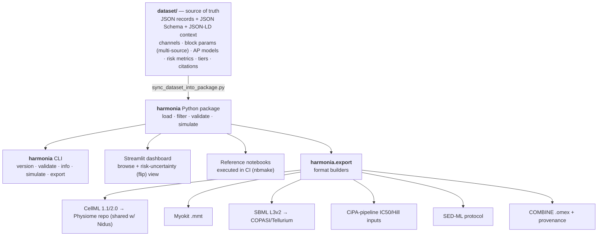
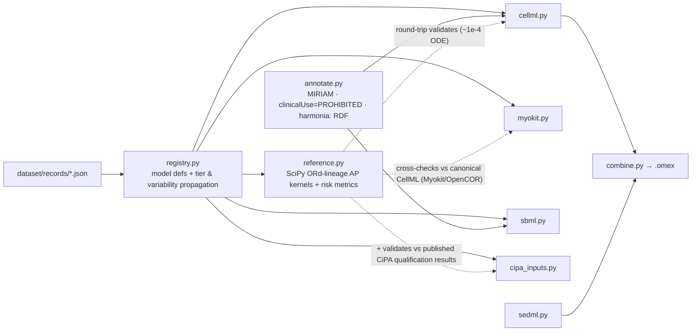

# Harmonia — design spec (v0.1)

**A curated, citation-backed dataset of cardiac ion-channel drug-block parameters and the in-silico ventricular action-potential models that turn them into a torsade-de-pointes (proarrhythmia) risk assessment — annotated with explicit confidence tiers *and inter-assay / inter-laboratory variability*, and exportable into the standard cardiac-electrophysiology and systems-biology formats (CellML, Myokit, SBML, SED-ML, and the CiPA in-silico pipeline).**

> *Harmonia* (Greek goddess of harmony and concord) — and *harmony* is exactly what a healthy cardiac rhythm is; *arrhythmia* is its loss. The same kind of name as its siblings: a piece of Greek that is also the precise concept the dataset serves — here, the orderly rhythm a safe drug preserves and a torsadogenic one destroys.

> **Naming is provisional — check PyPI and GitHub first.** Backups, with reasoning:
> - **Kardia** (Greek *καρδία*, "heart" — the literal root of *cardio-*) — the most consistent with Onkos's root-of-the-field style, but **collides with AliveCor's "KardiaMobile" ECG product** in exactly this domain; bad for search. Use only if you accept the collision.
> - **Eunomia** (Greek goddess of good order / lawful conduct, one of the Horae) — "good order" maps neatly to normal sinus rhythm; lower collision than Harmonia; more obscure.
> - **Sinus** (sinoatrial node / "sinus rhythm" + Latin *sinus*) — a clean anatomical pun, but enormous collision (sine, sinus infection).
>
> I'd lead with `harmonia`: it sits in the same register as **Hypnos** (a deity whose name *is* the concept), and "rhythm in concord vs. its dangerous twisting" is precisely the thing being modeled.

This is the fourth in a family with **Nidus** (gestational physiology), **Hypnos** (anesthetic PK/PD), and **Onkos** (oncology TGI/survival). It reuses their architecture, their tier philosophy, and their "infrastructure not simulator; honest about uncertainty by default" stance — and it **completes a natural arc**: the four together are physiology → dosing → efficacy → **safety**. Harmonia also shares its native format, **CellML**, with Nidus (the cardiac-electrophysiology community is the heaviest CellML user, via the Physiome model repository), and it **composes with Hypnos**: a drug's free-plasma-concentration trajectory (Hypnos-style PK) can drive the channel-block scaling that Harmonia turns into a proarrhythmia assessment — a PK → cardiac-safety chain.

Where Harmonia differs from its siblings, it's because the *inputs themselves* are the dominant source of uncertainty here. In oncology the risk was transporting a model out of context; in cardiac safety the risk is that the very IC50 you feed the model varies by orders of magnitude across labs and assays, and often can't be reliably measured at all. So Harmonia's load-bearing idea is the propagation of **input variability** to the **safety classification**.

---

## 1. The problem this dataset solves

Drug-induced QT prolongation and torsade de pointes (TdP) — a potentially lethal ventricular arrhythmia — have been a leading cause of late-stage drug attrition and market withdrawal. The FDA-initiated **Comprehensive in vitro Proarrhythmia Assay (CiPA)** modernized safety assessment around an in-silico paradigm: measure a drug's block of the major cardiac ion currents in vitro (a half-maximal inhibitory concentration, IC50, and a Hill coefficient per current — for the rapid delayed-rectifier potassium current IKr/hERG, often a dynamic binding model instead), feed these into an in-silico human ventricular myocyte model of the O'Hara-Rudy lineage (ORd → the IKr-dynamic CiPAORd v1.0 → the Tomek–O'Hara-Rudy ToR-ORd), simulate the action potential, compute a mechanistic risk metric (e.g., qNet, cqInward, occurrence of early afterdepolarizations), and stratify TdP risk into high / intermediate / low against a designated set of training and validation compounds.

The model machinery is published and partly open. The **inputs are the problem**:

- The channel-block parameters (IC50, Hill, binding kinetics) for a given drug are scattered across primary papers and their supplements, measured on different platforms (manual vs. automated patch clamp), at different temperatures, in different expression systems.
- **Inter-laboratory variability is notorious** — IC50 values for the same drug-channel pair routinely differ several-fold across sources.
- For a large fraction of published pharmacology, the maximum block achieved was below ~60%, which **precludes a reliable IC50 estimate at all** — yet such values still get used as point estimates.
- The accuracy of the final TdP-risk call therefore depends as much on the variability and quality of the input data as on the model — a fact the uncertainty-quantification literature has demonstrated but which no dataset operationalizes.

There is, today, no curated, tier-annotated, machine-readable resource that aggregates multichannel block parameters per drug *across sources*, records the assay context that governs their reliability, surfaces the inter-source variability as a first-class field, and exports the whole thing into runnable cardiac-model form.

**Harmonia is that resource** — curated once, citation-backed, tier-annotated, variability-aware, machine-readable, and exported into CellML / Myokit / SBML / the CiPA pipeline. It is the smallest piece of infrastructure that could make in-silico proarrhythmia assessment **honest about input uncertainty by default.**

### Why this is the right project (and why this scope)

It is genuinely underbuilt — the data and models exist separately, but the curated, uncertainty-propagating layer between them does not. It is high-impact — cardiotoxicity is a top reason drugs fail and get withdrawn, and CiPA is an active regulatory modernization. It adds a *new model class* to the family (biophysical action-potential ODE/Markov models, not PK/PD or tumor dynamics), broadening the toolchain. And it is **safe for a solo open-source builder**: it is safety-pharmacology *methodology* — no wet lab, no clinical deployment, and explicitly a *support for*, not a replacement of, the regulatory paradigm.

---

## 2. Scope — the declared envelope

Harmonia covers **published cardiac ion-channel drug-block parameters, the in-silico human ventricular action-potential models that consume them, and the TdP-risk metrics derived from those models**, for in-silico proarrhythmia (CiPA-style) assessment in humans.

**In scope**

- The major cardiac currents and their model formulations: IKr (hERG), IKs, ICaL, INaL, INa (peak), Ito, IK1.
- Per-drug, per-channel block parameters: IC50, Hill coefficient, and (for IKr) dynamic drug–channel binding kinetics — each with full assay metadata.
- The ventricular AP models of the O'Hara-Rudy lineage: ORd, the IKr-dynamic CiPAORd v1.0, ToR-ORd — structure and parameter sets.
- TdP-risk biomarkers: qNet, cqInward, EAD occurrence, APD90, triangulation, electromechanical window.
- The CiPA reference compound sets (training and validation) with their expert-assigned risk labels and free therapeutic plasma concentrations (EFTPC).
- The exposure layer needed to scale block: free (unbound) plasma concentration and protein binding.

**Out of scope (declared exclusions)**

- Any determination that a drug *is safe* (or unsafe) for clinical use, any regulatory safety determination, and any per-patient decision. *(See §10. Hard line.)*
- Atrial-specific and conduction-system arrhythmia mechanisms in v0.x (the ventricular-AP / TdP framework is the initial envelope).
- Mechanical / electromechanical coupling beyond the electromechanical-window biomarker.
- De novo ion-channel structural/biophysics modeling (Harmonia consumes published channel models; it does not derive new ones).
- Population/disease-background variability ships only as a **hypothesis-tier** subsystem with non-predictive labeling (§3, §10).

---

## 3. Subsystems

The family's "subsystems" map here onto the **layers of the in-silico proarrhythmia pipeline plus the reference compound library.**

| Subsystem | What it covers | Canonical sources (illustrative) |
| --- | --- | --- |
| `ion_channels` | The cardiac currents and their model formulations (IKr, IKs, ICaL, INaL, INa, Ito, IK1) | O'Hara et al. 2011; CiPA IKr Markov model |
| `channel_block` | Per-drug, per-channel block (IC50, Hill, IKr binding kinetics) + assay metadata + multi-source values | CiPA block-potency datasets; primary patch-clamp papers |
| `ap_models` | The ventricular AP models (ORd; IKr-dynamic CiPAORd v1.0; ToR-ORd) + state/parameter sets | O'Hara-Rudy 2011; Li et al. 2017; Tomek et al. |
| `risk_metrics` | TdP-risk biomarkers (qNet, cqInward, EAD occurrence, APD90, triangulation, electromechanical window) | CiPA qualification analyses |
| `drug_reference_sets` | CiPA training (12) + validation (16) compounds with expert risk labels and EFTPC | Colatsky/Fermini et al.; CiPA working groups |
| `exposure` | Free therapeutic plasma concentration & protein binding used to scale block | drug labels / PK literature (composable with Hypnos) |
| `populations` ⚠️ | Population-of-models / disease & genetic backgrounds (**hypothesis-tier, not for prediction**) | population-of-models studies (qualitative) |

Each subsystem record stores, at minimum, the model/parameter, its formulation/units, and its membership.

---

## 4. The record — the unit of curation

As in the sibling projects, a record is a *structured object*. Harmonia records come in two complementary kinds sharing one schema:

- a **channel-block record** (a drug × channel: IC50, Hill, binding kinetics, with assay metadata and *multiple source values*);
- an **AP-model record** (e.g., the CiPAORd v1.0 model: structure + parameters + provenance).

```jsonc
{
  "id": "channel_block.dofetilide.ikr",
  "kind": "channel_block",                 // channel_block | ap_model
  "drug": { "name": "dofetilide", "unii": "..." },
  "channel": "IKr",
  "block_model": "dynamic_binding",        // hill | dynamic_binding
  "parameters": [
    { "symbol": "IC50", "label": "half-maximal inhibitory concentration",
      "value": { "central": 4.3, "low": 1.6, "high": 12.0, "units": "nM" },
      "tier": "B", "primary_citation": "crumb-2016-block-potency" }
    // for hERG dynamic binding: kon, koff, trapping flags instead/also
  ],
  "assay_context": {                        // governs whether the value is even reliable
    "platform": "manual_patch_clamp",
    "temperature_c": 37,
    "expression_system": "HEK293",
    "max_block_observed_percent": 92,       // <60% => IC50 unidentifiable => tier D
    "holding_protocol": "..."
  },
  "source_values": [                        // the variability, made first-class
    { "ic50_nm": 4.3,  "platform": "manual",    "citation": "crumb-2016" },
    { "ic50_nm": 11.8, "platform": "automated", "citation": "..." },
    { "ic50_nm": 1.9,  "platform": "manual",    "citation": "..." }
  ],
  "variability": { "fold_range": 6.2, "n_sources": 3, "iqr_nm": [2.6, 9.1] },
  "known_failure_modes": [
    { "condition": "max_block_observed_percent < 60",
      "behavior": "IC50 not identifiable; point estimate misleading",
      "action": "tier_down_to_D and warn", "citation": "..." },
    { "condition": "automated vs manual patch-clamp discrepancy > 5-fold",
      "behavior": "platform-dependent risk classification flip",
      "action": "flag and propagate both", "citation": "..." }
  ],
  "tier": "B",
  "primary_citation": "crumb-2016-block-potency"
}
```

The fields that carry the project — the analog of Nidus's confidence tier, Hypnos's applicability envelope, and Onkos's transportability:

- **`source_values` + `variability`** — *multiple* labs'/assays' measurements of the same IC50, with the inter-source spread (fold-range, IQR) computed and stored. This is the load-bearing idea: input variability is not hidden behind a single number.
- **`assay_context`** — the platform, temperature, expression system, and especially **the maximum block actually observed**, because below ~60% block the IC50 is unidentifiable and any point estimate is fiction. This is what lets a Tier-D "we don't actually know this IC50" be stated honestly.

---

## 5. Confidence tiers (adapted for channel block & AP models)

Same A/B/C/D spine; re-specified for ion-channel pharmacology and AP models. As with the siblings, assignment is partly numeric — there is a concrete data-quality question (was enough block observed to identify the IC50? do independent labs agree?) and a concrete model question (did the AP model classify the CiPA *validation* set correctly?).

| Tier | Meaning |
| --- | --- |
| **A** | Multiple independent labs/assays agree (low fold-range), sufficient block (≳60%) for reliable IC50, mechanism clear; for AP models, validated on the CiPA validation compound set with good classification performance. |
| **B** | One good-quality measurement with adequate block; some cross-check or a single well-curated source. |
| **C** | Single measurement; low/borderline block fraction; or unresolved manual-vs-automated discrepancy. |
| **D** | Max block < ~60% (IC50 unidentifiable / extrapolated), **or** population/disease extrapolation, **or** hypothesis-tier. **Not predictive.** |

**Tier propagation *and* uncertainty propagation — the family rule, extended.** A TdP-risk classification composes ~7 channel-block records + an AP model + a risk metric. It inherits the **worst** tier among them (so a single unidentifiable IC50 caps the whole assessment at D), and — uniquely for Harmonia — the **input variability is propagated** by Monte-Carlo sampling over each channel's `source_values` distribution, producing a **distribution of risk-metric outcomes and a classification-flip frequency**, never a bare point classification. Every export carries the propagated tier as RDF (`harmonia:confidenceTier`) and, where computed, a summary of the risk-metric uncertainty.

---

## 6. Reference kernels & the simulator boundary

Every AP-model record binds to a **reference kernel** — a SciPy integration of the published O'Hara-Rudy-lineage equations with Hill / dynamic-binding pharmacology applied per current — used to compute the action potential and the risk biomarkers (APD90, qNet, cqInward, EAD detection, triangulation). Exports are round-trip validated against this kernel (tolerances in the family's tradition: ≈1e-4 relative for the ODE traces), **and** against the published CiPA qualification results for the training compounds.

Because the ORd lineage is large, the kernel additionally cross-checks against the canonical **CellML** model (via Myokit/OpenCOR) so that "the equations as implemented here" provably match "the equations as published." Myokit may also be used as an optional faster simulation engine, but it is never required at load time — exports remain generated artifacts, not a runtime dependency, exactly as in the siblings.

**Harmonia is NOT a regulatory engine and NOT a clinical safety oracle.** It simulates action potentials and computes risk-metric *distributions* for research, comparison, and export validation. The dashboard's headline feature is the honest-uncertainty view:

> **Risk-uncertainty (classification-flip) view.** Pick a drug; Harmonia pulls the *spread* of published IC50s per channel (across labs, platforms, temperatures), propagates that spread through the chosen AP model, and shows the **distribution of the TdP-risk metric** and **how often the high/intermediate/low classification flips** depending on which sources you believe and which AP-model variant you use. Channels whose IC50 is unidentifiable (block < 60%) are flagged, not silently point-estimated. This makes the dependence of a safety call on input-data variability *visible and quantitative* — the precise finding of the uncertainty-quantification literature, operationalized. It is the Harmonia analog of Nidus's tier-distribution figure, Hypnos's model-divergence view, and Onkos's virtual-trial divergence view.

---

## 7. Export formats — the cardiac-EP + systems-biology interop layer

| Format | Role | Family analog |
| --- | --- | --- |
| **CellML** (1.1 / 2.0) | The native language of cardiac electrophysiology and the Physiome model repository; the ORd lineage lives there. Primary anchor — and the shared format with **Nidus**. | Nidus/Hypnos CellML |
| **Myokit** (`.mmt`) | The dominant open Python tool for cardiac AP simulation and CiPA-style work; a Myokit model + pacing protocol is the most directly runnable artifact. | (new) |
| **SBML** (L3v2) | The AP models are ODE systems → COPASI/Tellurium/BioModels and continuity with the family. | Nidus/Hypnos/Onkos SBML |
| **CiPA-pipeline inputs** | The IC50 / Hill (and dynamic-binding) table format the reference CiPA in-silico tool ingests, so curated, variability-annotated block parameters drop straight into the established pipeline. | Hypnos TCI-sim JSON / Onkos virtual-trial JSON |
| **SED-ML** | The simulation-protocol descriptors (pacing rate, drug concentrations, beats to steady state), so a risk computation is reproducible — paired with CellML in the cardiac-modeling convention. | (new) |
| **CSV / BibTeX** | Flat parameter + citation export. | family |
| **COMBINE `.omex`** | Bundles CellML + SED-ML + SBML + provenance. | family `.omex` |

**Exports are generated, never hand-edited** (CI regenerates on every push), and each carries: a `harmonia:datasetVersion` pin; the propagated tier and any variability/failure-mode warnings as MIRIAM-style RDF (with `bqbiol:isDescribedBy` DOI/PMID links surviving predicate-stripping); and a universal, machine-readable **`harmonia:clinicalUse = "PROHIBITED — research / safety-methodology / education only; not a regulatory determination"`** annotation on every exported model.

---

## 8. Architecture

The **dataset is the single source of truth**; everything else is a deterministic projection — identical to Nidus, Hypnos, and Onkos.





**Design decisions and why (the family table, ported):**

| Decision | Rationale |
| --- | --- |
| **Pure Python** reference kernel (SciPy); Myokit optional, CellML canonical | Validation must not depend on a heavy engine at load time; exports are artifacts. Myokit/OpenCOR provide the cross-check that the equations match the published CellML. |
| **Dataset is the centerpiece; everything else is a presentation layer** | The durable contribution is the curated, multi-source, tier-annotated block parameters. |
| **`source_values` + `assay_context` are first-class; variability is propagated** | Input variability — not the model — is the dominant uncertainty in proarrhythmia assessment; making it machine-enforced is the load-bearing idea. |
| **Output is a risk *distribution* and a flip-frequency, never a bare classification** | A single high/intermediate/low label hides exactly the uncertainty that matters for a safety decision. |
| **Tiers + variability propagate; worst input wins; unidentifiable IC50 caps at D** | A safety call is only as trustworthy as its least-identifiable channel. |
| **Methodology only; never a regulatory or clinical determination** | The line is making (or appearing to make) a safety verdict. Harmonia reports data and model outputs with uncertainty; it does not adjudicate safety. |
| **CellML primary; composable with Hypnos** | Shares Nidus's format and ties to the Physiome repo; a Hypnos PK exposure can drive Harmonia's block scaling. |

---

## 9. Validation & verification workflow

**Round-trip validation** (CI): every exported CellML/SBML model is re-simulated and checked against the pure-Python reference kernel within tolerance; the kernel is additionally cross-checked against the canonical CellML model via Myokit/OpenCOR so "implemented equations" provably equal "published equations."

**Qualification validation**: the kernel reproduces the published CiPA qualification results for the training compounds, and its classification performance on the validation compounds is recorded — this is what lets an AP-model record earn Tier A.

**Human verification** (the gate on `verified`): a contributor opens the source PDF/supplement and confirms (1) each block parameter *and the assay context*, especially the maximum block observed (the reliability gate), (2) the AP-model equations and parameters, (3) the dynamic-binding kinetics where used, and (4) the reference compound's risk label and EFTPC. Only then does `review_status` move to `verified`. LLMs assist but never promote; the verified count is reported honestly.

**The single highest-leverage contribution**, as in every sibling: promoting `unverified` records to `verified` by reading the source — with the cardiac-specific twist that the **assay context and the multiple source values** are the part most worth scrutiny, because that's where the hidden variability and the unidentifiable-IC50 traps live.

---

## 10. Safety & scope guardrails (non-negotiable)

Harmonia's misuse risk is subtler than its siblings' — nobody dies directly from a dataset — but a proarrhythmia *verdict* carries weight, so the guardrails target the appearance of adjudication:

- **NOT a clinical tool, NOT a regulatory safety determination, NOT a verdict that a drug is safe or unsafe.** It is research, method development, education, and *support for* (never replacement of) the CiPA paradigm.
- **No bare safety classification as an authoritative output.** Harmonia reports a risk-metric *distribution* with its full input uncertainty and a classification-flip frequency; it explicitly refuses to present a single high/intermediate/low label as a determination.
- **No claim of drug safety.** Outputs describe published in-vitro block data and model behavior, with all attached variability and tier — not a conclusion about a drug.
- **Unidentifiable inputs are stated, not imputed.** Where block < ~60%, the IC50 is reported as unidentifiable (Tier D), not as a point estimate.
- **Every export carries `clinicalUse = "PROHIBITED — research / safety-methodology / education only; not a regulatory determination"`** — universal, human- and machine-readable.
- **The `populations` subsystem ships hypothesis-tier** with a "DO NOT USE FOR PREDICTION" annotation (the family's Phase-C convention).
- Like its siblings: not exhaustive, not a replacement for expert judgment, not an automated researcher.

The tell that the project has crossed its line: any feature that emits a single, authoritative "this drug is safe/unsafe" verdict without its uncertainty. That feature does not get built.

---

## 11. Phased roadmap

| Phase | Content | Done = |
| --- | --- | --- |
| **A — CiPA spine** | Channel-block records + the ORd AP model + the qNet risk metric for the 12 CiPA *training* drugs, end to end, with CellML + Myokit export, round-trip validation, and the risk-uncertainty (flip) view. | The canonical pipeline runs on the training set and uncertainty is visible. |
| **B — Dynamic hERG + validation** | The IKr-dynamic CiPAORd v1.0 with drug-binding kinetics; the 16 validation drugs; recorded classification performance. | The regulatory-grade model variant works and is externally checked. |
| **C — Variability layer** | Multi-source IC50 aggregation across labs/platforms/temperatures with computed fold-range/IQR; ToR-ORd variant; SED-ML + COMBINE. | The headline "input-variability → flip-frequency" feature is fully data-backed. |
| **D — Exposure layer** | Free plasma concentration + protein binding (composable with Hypnos); drug-combination assessment. | Exposure-scaled, multi-drug assessment is in. |
| **E — Populations (hypothesis-tier)** | Population-of-models / disease & genetic backgrounds, shipped non-predictive. | The frontier is represented honestly. |
| **F — Hardening** | Performance backfill; COMBINE `.omex`; Zenodo DOI; CITATION.cff. | Citable, reproducible, releasable. |

Phase A alone is a self-contained, genuinely useful release: an open, validated, tier-annotated CiPA training-set pipeline with an honest input-uncertainty view is something the field discusses in papers but does not ship as curated infrastructure.

---

## 12. Repository layout

```
harmonia/
├── README.md
├── LICENSE                      # MIT (code)
├── LICENSE-DATASET              # CC-BY-4.0 (data)
├── CITATION.cff
├── CONTRIBUTING.md              # tier system, assay-context rules, multi-source aggregation, PDF-verification checklist
├── dataset/
│   ├── schema/                  # JSON Schema + JSON-LD context
│   ├── records/                 # one JSON per channel-block / AP-model record (source of truth)
│   └── citations/               # Crossref/PubMed-verified citation records
├── python/
│   └── harmonia/
│       ├── load.py · filter.py · validate.py
│       ├── simulate.py          # AP simulation + risk-metric distribution (no safety verdict)
│       └── export/
│           ├── registry.py · reference.py
│           ├── cellml.py · myokit.py · sbml.py · cipa_inputs.py · sedml.py
│           ├── combine.py · annotate.py
├── dashboard/                   # Streamlit: browse + risk-uncertainty (flip) view
├── notebooks/                   # executed in CI (nbmake), incl. flip-frequency figure
└── docs/
    ├── about/essay.md           # "why input variability is the load-bearing idea"
    └── specs/v0.1/              # this document and siblings
```

---

## 13. Cheat sheet (target API)

```python
import harmonia
ds = harmonia.load()

b = ds["channel_block.dofetilide.ikr"]
b.tier                                  # "B"
b.assay_context.max_block_observed_percent   # 92  (>60 => identifiable)
b.variability.fold_range                # 6.2  -> inter-source spread is first-class
b.source_values                         # the individual lab measurements
b.extraction.review_status              # "verified" | "unverified" | "contested"
b.primary_citation.doi

# Simulate an action potential + risk-metric DISTRIBUTION (never a bare verdict)
import numpy as np
from harmonia.simulate import assess
res = assess(ds, drug="dofetilide", ap_model="cipaordv1.0",
             exposure_nM=np.array([1, 3, 10, 30]),     # or pipe a Hypnos PK trajectory
             metric="qNet", n_mc=2000)                 # Monte-Carlo over source variability
res.qnet_distribution                   # distribution, not a point value
res.classification_flip_frequency       # how often high/intermediate/low flips
res.tier, res.warnings                  # propagated tier + unidentifiable-channel flags

# Risk-uncertainty comparison — the headline feature
cmp = harmonia.flip_view(ds, drug="dofetilide", ap_models=["ord", "cipaordv1.0", "tor_ord"])
cmp.flip_by_model                       # classification stability across model variants
cmp.excluded                            # channels with unidentifiable IC50 (block < 60%)
```

```bash
harmonia version
harmonia validate                                # JSON-Schema-validate the dataset
harmonia info                                     # counts by subsystem / tier / review status
harmonia export --format cellml  --output exports/cellml/
harmonia export --format myokit  --output exports/myokit/
harmonia export --format sbml    --output exports/sbml/
harmonia export --format cipa    --output exports/cipa_inputs/
harmonia export --format omex    --output exports/harmonia.omex
streamlit run dashboard/app.py
```

---

## 14. Relationship to Nidus, Hypnos, and Onkos

The four are one body of work with one thesis: **a model is only as trustworthy as its weakest, least-validated input — so make that fact a first-class, machine-readable field.** Together they trace a clean arc through drug development and physiology:

| Project | Domain | Load-bearing idea | Native format |
| --- | --- | --- | --- |
| **Nidus** | gestational physiology | per-parameter **confidence tier** | SBML / CellML |
| **Hypnos** | anesthetic PK/PD (dosing) | **applicability envelope** + failure modes | PharmML / NONMEM |
| **Onkos** | oncology TGI → survival (efficacy) | **derivation context + transportability** | NONMEM / SBML |
| **Harmonia** | cardiac proarrhythmia (safety) | **input variability propagation** | CellML / Myokit |

→ **physiology → dosing → efficacy → safety.** They share architecture (dataset-as-source-of-truth → package → CLI/dashboard/exports; registry → reference kernels + format builders + round-trip validation), license posture (MIT code, CC-BY-4.0 data), citation posture (Zenodo DOI + per-record primary source), and a hard "infrastructure, not a clinical tool" boundary. Harmonia shares **CellML** with Nidus (the Physiome lineage), and **composes with Hypnos**: a drug's free-plasma-concentration trajectory (Hypnos PK) can scale Harmonia's channel block, giving an open, tier-annotated PK → proarrhythmia chain — the dosing and safety ends of the same molecule, in one toolchain.

---

## 15. Licensing & citation

- **Code:** MIT.
- **Dataset:** CC-BY-4.0 — each record is data; attribution required, no other restriction.
- **Citation:** Zenodo concept DOI on first release; `CITATION.cff` for machine-readable metadata. Every record exposes its own primary-source DOI via `record.primary_citation.doi` — when you use one record, cite Harmonia **and** the original source.

---

## 16. One-paragraph pitch (for the README top / Zenodo abstract)

> Harmonia is a curated, citation-backed, machine-readable dataset of the cardiac ion-channel drug-block parameters and the in-silico ventricular action-potential models that the CiPA proarrhythmia paradigm depends on. Every record carries an explicit confidence tier, full assay context (including whether enough block was observed to identify the IC50 at all), and — crucially — the *multiple source measurements* and their inter-laboratory variability; and it exports cleanly into CellML, Myokit, SBML, SED-ML, and the CiPA pipeline. It does not issue safety verdicts and is not a regulatory determination; it reports a torsade-risk-metric distribution and a classification-flip frequency that make the dependence of a safety call on input-data variability visible by default. It is the fourth sibling of Nidus, Hypnos, and Onkos — completing a physiology → dosing → efficacy → safety arc — built on the same principle: a model is only as trustworthy as its weakest, least-validated input, so make that a first-class, machine-readable field.
